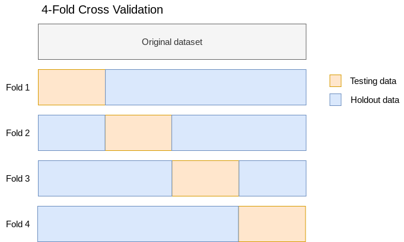
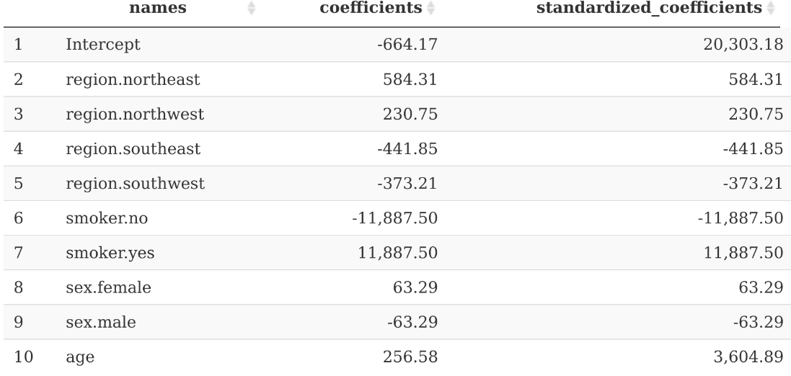

```{r setup, include=FALSE}
knitr::opts_chunk$set(echo = TRUE, eval = F)
```

# Introduction

## About this course

In this course, you'll code machine learning workflows using R and H2O software. You'll learn how to build regression and classification models that are accurate, scalable, explainable, and easy to implement. This course will teach you how to select the highest performing model using rigorous training strategies such as cross validation and hyperparameter tuning.

The code for this course is built around the R programming language and H2O software, two of the premier frameworks for applied data science and machine learning. Additionally, R packages `dplyr` and `ggplot2` are used to support data analysis and visualization. 

## Why you should choose this course

After this course, you will be equipped with the knowledge to do the following.

- Complete industry-level machine learning projects with confidence and success
- Compete in machine learning competitions on platforms such as Kaggle
- Add machine learning projects and skills to your professional portfolio and resume
- Critically evaluate machine learning works and recognize flaws in methodology

## Target audience

This book is intended for anyone interested in applying machine learning to real-world data sets. Basic knowledge of the R programming language and data analysis is recommended. Because this course is focused on applied machine learning, knowledge of the theory or mathematics behind machine learning is not required.

## What you will learn

The following topics are covered in this course.

- Importing and exploring data
- Connecting to a local H2O cluster
- Automatic machine learning (AutoML)
- Regression algorithms
  - Linear Regression
  - Random Forest
- Classification algorithms
  - Logistic Regression
  - Gradient Boosted Trees
- Cross validation
- Hyperparamter tuning
- Evaluating model performance
- Selecting the best model
- Identifying and explaining important features

## About H2O

H2O is recognized as one of the leading providers of open-source machine learning software. The accuracy, selection, speed, and scalability of H2O's algorithms make it ideal for machine learning projects.

## About R

R is among the most popular open-source tools for data science and analytics. This make R a natural fit for machine learning since most machine learning workflows involve a significant amount of data analysis. Additionally, the R client for H2O is simple, consistent, and easy to install.

## About machine learning

The ultimate power of machine learning is in its ability to predict outcomes with high levels of accuracy. Unlike stastical modeling, machine learning is less concerned with estimating parameters and more concerned with predicting outcomes. Many problems encountered in industry are complex yet seemingly predictable. Such problems are often very good use cases for machine learning. For example, whether or not a customer is likely to churn may be dependent on a large number of complex factors, yet companies across many industries successfully leverage machine learning to predict this outcome.

Machine learning can be applied or theoretical. Applied machine learning, which is the focus of this course, emphasizes the code and the methods applied to real data sets. On the other hand, theoretical machine learning emphasizes the underlying mathematics and the inner-workings of algorithms. While theoretical machine learning is very important to the disciple, applied machine learning produces more results in industry.

## About the author

Danny Morris is a Principal Data Scientist with extensive experience in building and deploying machine learning models in industry. He has built models for the following business problems.

- Customer churn
- Sales forecasting
- Insurance claims forecasting
- Customer segmentation
- NLP text similarity
- Image recognition
- Disease propensity modeling

# Key machine learning concepts

This chapter details the key concepts you need to know in order to successfully train and evaluate machine learning models.

## Classification

Classification algorithms attempt to predict discrete outcomes. For example, classifiers are used to predict whether or not a customer will churn. When the discrete outcome contains only two groups, then the problem is known as *binary classification*.

## Regression

Regression algorithms attempt to predict numerical oucomes. For example, regressors are used to predict an individual's future healthcare costs.

## Model training

Training is the overall process of feeding data to a machine learning algorithm for it learn patterns in the data. The training phase presents an opportunity to iteratively experiment with various machine learning algorithms and techniques in order to discover the best possible model for the problem at hand.

## Features

Also known as independent variables, features are variables in the data set which are used to predict the target variable. For example, product price and product ratings are commonly used as features for predicting customer churn.

## Target variable

Also known as the dependent variable, the target variable is the outcome you are attempting to predict using machine learning. For example, the target variable in a customer churn problem is often a binary outcome with values "Yes" (the customer did churn) and "No" (the customer did not churn).

## Instances

Also known as observations, instances are individual examples of the units under analysis in the data. For example, in a customer churn problem an instance represents a single customer.

## Predicted values

Predicted values are values for the target variable that are predicted by the machine learning model after model training is complete.

## Actual values

Actual values are values for the target variable that are already present in the data set prior to model training.

## Training data

Training data is a partition of the original data set that is used for training the machine learning algorithm. Training data should not be used for measuring the accuracy of the machine learning model.

## Testing data

Testing data is a partition of the original data set that is used for evaluating the accuracy of the machine learning algorithm. Testing data and training data should be mutually exclusive in order to avoid data leakage.

## Postive and Negative classes

In classification modeling, classes are the groups represented in the target variable. For example, in a customer churn problem the positive class includes customers who did churn and the negative class includes customers who did not churn. 

## Class imbalance

Class imbalance occurs when the number of instances is one class greatly outweighs the number of instances in the opposite class. For example, a data set containing 100 positive instances and 1,000 negative instances would gernally be viewed as imbalanced. 

Imbalanced data may present a risk since the majority class can easily overwhelm the minority class if the imbalance is severe enough. A common remedy for imbalanced classes is to balance the data during the training phase. Balancing classes is done by either oversampling the minority class (i.e. artificially increasing the amount of data until balance is achieved) or undersampling the majority class (i.e. artificially decreasing the amount of data until balance is achieved).

## Overfitting

Overfitting occurs when a machine learning algorithm learns patterns in the training data that do not generalize well to testing data. This can happen if the training data and testing data are not representative of one another. This can also happen if the algorithm's hyperparameters are not properly set. Either way, strategies such as cross validation and hyperparameter tuning exist to prevent overfitting.

## Cross validation

Cross validation is a training strategy for rigorously evaluating the accuracy of a machine learning model and preventing overfitting. In essence, cross validation is a strategy for testing a machine learning algorithm on multiple subsets of the data. Testing a model on multiple subsets of the data instead of a single subset only helps to avoid overfitting and results in more robust estimates of accuracy. 

Cross validation is done by partitioning multiple training and testing sets from the original data set into *folds*. Within each fold, training and testing is performed in the normal way. Once all folds are complete, accuracy metrics and predictions from the individual folds are aggregated to produce the final results.

Below is an illustration of cross validation. Notice that within each fold, a unique subset of the original data is used for testing and the remaining data are used for training.



## Hyperparameter tuning

Hyperparameter tuning is a training strategy for arriving at the best model with the highest degree of accuracy. Hyperparameters are algorithm-specific, user-defined settings that can greatly impact model performance if not set correctly. Furthermore, some algorithms have thousands of hyperparameter combinations. Therefore, an efficient hyperparameter tuning strategy is often necessary for discovering the best possible model in the shortest amount of time.

## Accuracy metrics

In this course, machine learning models are judged on their ability to accurately predict outcomes. The following metrics are discussed in this course. 

### Classification algorithms

- **Precision**: Precision measures the proportion of predicted positive values that are actual positive values. For example, if a machine learning model predicts 100 customers will churn and 90 customers actually churned, then precision equals 0.9. Precision values range from 0 to 1. Values closer to 1 are preferred.

- **Recall**: Recall measures the proportion of actual positive values that are predicted by the model to be positive. For example, if a data set contains 100 customers who actually churned and 70 were correctly predicted to churn, then recall equals 0.7. Recall values range from 0 to 1. Values closer to 1 are preferred.

- **F1**: F1 score intends to strike a balance between Precision and Recall. Because Precision and Recall each have strengths and weaknesses, F1 score is often a good metric to optimize. F1 scores range from 0 to 1. Values closer to 1 are preferred.

- **AUC**: AUC measures the ability of the classification model to correctly distinguish between positive and negative classes. AUC values range from 0 to 1. Values closer to 1 are preferred.

- **Misclassification rate**: Also known as "accuracy", misclassification rate measures the proportion of actual values that are correctly predicted regardless of class. Though intuitive, misclassification rate is often not a useful metric because it is highly sensitive to class imbalance. Misclassification rates range from 0 to 1. Values closer to 1 are preferred. 

### Regression algorithms

- **R-squared**: R-squared measures the percentage of variation in the target variable that is explained by the machine learning model. A highly accurate machine learning model will explain a significant proportion of the variation in the target variable. R-squared values generally range from 0 to 1. Values closer to 1 are preferred.

- **RMSE**: RMSE (root mean squared error) measures the aggregate deviance between actual values and predicted values. The calcuation involves squaring each deviance, taking the square root, then computing the mean of the square root values. Because RMSE involves squaring the deviances between actual and predicted values, RMSE penalizes large deviances. RMSE values range from 0 to infinity. Values closer to 0 are preferred.

- **MAE**: MAE (mean absolute error) measures the aggregate deviance between actual values and predicted values. The calculation involves computing the absolute deviances then computing the mean of all absolute deviances. Unlike RMSE, MAE does not penalize large deviances. MAE values range from negative infinity to postive infinity. Values closer to 0 are preferred.

# Technical setup

## R version and OS

```{r}
R.version
```

## Java version

```{r}
system("java --version")
```

## Install package dependencies from CRAN

```{r, eval = F}
install.packages("h2o")
install.packages("dplyr")
install.packages("ggplot2")
```

## Load packages

```{r}
library(h2o)
library(data.table)
library(dplyr)
library(ggplot2)
```

# Classification modeling

## Objective

In this chapter, you will apply two contrasting classification algorithms, Logistic Regression and Gradient Boosted Trees, to predict whether or not a customer will churn. In the data set, the column named `Churn` is the target variable.

## Prerequisites

Review the key machine learning concepts discussed in chapter 2 prior to starting this chapter.

## Read local CSV file

Use the `fread()` function from the `data.table` package to read the local CSV file. Other CSV readers exist, such as `read.csv()` from the `utils` package, but `fread()` is substantially faster and more efficient.

```{r}
customer_churn <- data.table::fread("data/customer-churn.csv")
```

## Assess the data structure

Begin by inspecting the class of the data structure, which should be `data.table` and `data.frame`.

```{r}
class(customer_churn)
```

Get to know the basics of the data structure by running the `glimpse()` function from the `dplyr` package.

```{r}
glimpse(customer_churn)
```

The output indicates the data contains 7,043 rows and 21 columns in total. A mix of numeric and categorical features are present. 

## Assess missing values

Use the following custom function named `compute_percent_missing` to calculate the percentage of values in each column that are `NA`. Though H2O is capable of handling `NA` values with ease, it is important to detect any columns that contain a sufficiently large number of `NA` values and handle them accordingly.  

```{r}
compute_percent_missing <- function(x) {
  round(sum(is.na(x)) / length(x), 3)
}
```

Using the `sapply()` function, apply the `compute_percent_missing()` custom function to compute the percentage of values that are `NA` in each feature in the `insurance` data.

```{r}
sapply(customer_churn, compute_percent_missing)
```

The `TotalCharges` feature is the only feature with some `NA` values present. Since the number of missing values is very small, we are safe to include the feature in the model. As you will soon learn, H2O has built-in capabilities for handling `NA` values. 

## Assess the distribution of the target variable

Assess the distribution of the target variable `Churn` by calculating the prevalence of positive and negative classes.

```{r}
table(customer_churn$Churn) %>%
  prop.table()
```

This dataset contains 26.5% positive class and 73.5% negative class. While there are no strict thresholds for categorizing the degree of imbalance, the author would consider this dataset to be *moderately imbalanced*. During model training, you will have the opportunity to observe the effects of balancing the classes.

## Specify feature and target variable names

To comply with the H2O software, explicitly define the feature variables and target variable separately. Notice that the columns `customerID` is neither a feature nor the target variable.

```{r}
features <- customer_churn %>%
  select(-customerID, -Churn) %>%
  colnames()

target <- "Churn"
```

```{r}
print(features)
print(target)
```

## Connect to local H2O cluster

At this point, you are ready to launch a local H2O cluster. Run `h2o.init()` from the `h2o` package to initialize an H2O cluster on your local machine. By default, H2O uses all available CPUs to maximize speed and efficiency.

```{r}
h2o.init()
```

## Import data into H2O cluster

Import the `customer_churn` data into the local H2O cluster in order to use H2O's machine learning algorithms. 

At this time, consider converting all categorical features to class `factor` if they are to be used by H2O's algorithms. H2O's algorithms are not able to use categorical features unless they are of class `factor`.

```{r}
churn_h2o <- customer_churn %>%
  mutate_if(is.character, as.factor) %>%
  as.h2o()
```

The R object `churn_h2o` is of class `H2OFrame`, which is efficient and ideally suited for H2O's algorithms.

```{r}
class(churn_h2o)
```

## Describe the H2OFrame

Inspect `churn_h2o` once more before proceeding with model training to verify the data structure is as expected. The `h2o.describe()` function is recommending for summarizing an `H2OFrame` object.

```{r}
h2o.describe(churn_h2o)
```

## Logistic Regression 

The first classification algorithm you will train and evaluate is Logistic Regression.

### How it works

Logistic Regression is a linear model that predicts class probabilities using a linear combination of feature values and weights. The predicted class probabilities are transformed to values between 0 and 1, then a classification threshold is applied to convert predicted probabilities into discrete classes.

### Strengths

- Highly explainable due to interpretable feature weights
- Fast to train

### Weaknesses

- Often less accurate than alternatives
- Feature interactions must be specified explicitly

### Prepare hyperparameter tuning grid

The hyperparameter tuning grid contains all possible values for the hyperparameters you intend to tune.

For the logistic regression algorithm, you will tune the following hyperparameters.

- `alpha` is a regularization parameter that helps to avoid overfitting. Values range from 0 to 1. Values closer to 0 result in more Ridge regularization, whereas values closer to 1 result in more Lasso regularization. 

- `lambda` is another regularization parameter that influences the overall amount of regularization. Values range from 0 to 1. Values closer to 1 result in greater amounts of regularization.

```{r}
logistic_regression_hp_grid <- list(
  alpha = c(0.01, 0.1, 0.3, 0.5, 0.7, 0.9, 1),
  lambda = c(1, 0.5, 0.1, 0.01, 0.001, 0.0001, 0.00001, 0) 
)
```

### Define hyperparameter tuning strategy

The hyperparameter tuning strategy defines the overall hyperparameter tuning method. The main objective is to define a strategy that searches the entire hyperparameter space efficiently and returns a highly accurate model. 

For the logistic regression algorithm, your hyperparameter tuning strategy will use the following settings.

- `strategy = "RandomDiscrete` specifies random grid search. When random search is used, H2O randomly samples hyperparameter values uniformly until a high-performing subset is found. Random grid search is the recommended strategy for searching hyperparameter subspaces efficiently.

- `max_runtime_secs` specifies the amount of time (in seconds) hyperparameter tuning is permitted to run.

- `stopping_metric` specifies the metric used for early stopping. 

- `stopping_tolerance` specifies the minimum required improvement in the stopping metric before training ceases.

- `stopping_rounds` 

- `seed`

```{r}
logistic_regression_hp_strategy = list(
  strategy = "RandomDiscrete", 
  max_runtime_secs = 60, 
  stopping_metric = "AUTO", 
  stopping_tolerance = 0.00001, 
  stopping_rounds = 5, 
  seed = 123456
)
```

### Train model using cross validation and hyperparameter tuning

- `algorithm`

- `grid_id`

- `x`

- `y`

- `training_frame`

- `nfolds`

- `keep_cross_validation_predictions`

- `stopping_rounds`

- `stopping_tolerance`

- `stopping_metric`

- `seed`

- `hyper_params`

- `search_criteria`

- `family`

```{r}
logistic_regression <- h2o.grid(
  algorithm = "glm",
  grid_id = "logistic_regression_churn",
  x = features,
  y = target,
  training_frame = churn_h2o,
  nfolds = 5,
  keep_cross_validation_predictions = TRUE,
  stopping_rounds = 2,
  stopping_tolerance = 1e-3,
  stopping_metric = "AUTO",
  seed = 123456,
  hyper_params = logistic_regression_hp_grid,
  search_criteria = logistic_regression_hp_strategy,
  family = "binomial"
)
```

Learning opportunities:
- increase and decrease the number of cross validation folds, weighing changes in performance and wait times.
- set `standardize = FALSE` to undo the effects of centering and scaling the features

### Obtain model with best performing subset of hyperparameters

Chosen by CV since `nfolds` > 0.

```{r}
glm_sorted_grid <- h2o.getGrid(
  grid_id = "glm_churn_random_search", 
  sort_by = "f1",
  decreasing = TRUE
)

glm_best_model <- h2o.getModel(
  model_id = glm_sorted_grid@model_ids[[1]]
)

summary(glm_best_model)
```

### Inspect model details

```{r}
glm_best_model@model$model_summary %>%
  as_tibble() %>%
  gather(key, value)

glm_classification@summary_table
```

### Assess performance metrics

```{r}
# tibble(
#   r_squared = h2o.r2(linear_regression, xval = TRUE),
#   rmse = h2o.rmse(linear_regression, xval = TRUE),
#   rmsle = h2o.rmsle(linear_regression, xval = T)
# )

h2o.performance(glm_best_model, xval = T)

perf <- h2o.performance(glm_best_model, xval = T)

h2o.confusionMatrix(perf)
```

### Obtain and explain regression coefficients

```{r}
lr_best_model@model$coefficients_table
```

### Gains/Lift table

```{r}
h2o.gainsLift(glm_best_model, xval = T)
```

### Summarize findings

### Learning opportunities

## Gradient Boosted Classification Trees

### Strengths and weaknesses

### Prepare hyperparameter tuning grid

```{r}
gbm_clf_hp_grid = list( 
  ntrees = seq(50, 1000, 50), 
  max_depth = seq(1, 20, 1), 
  min_rows = c(1, 5, 10, 20, 50, 100), 
  learn_rate = seq(0.001, 0.01, 0.001),
  sample_rate = seq(0.3, 1, 0.05),
  col_sample_rate = seq(0.3, 1, 0.05),
  col_sample_rate_per_tree = seq(0.3,1,0.05),
  balance_classes = c(TRUE, FALSE),
  max_after_balance_size = seq(0.1, 5.1, 0.5)
)
```

### Define hyperparameter tuning strategy

The hyperparameter tuning strategy defines the overall hyperparameter tuning method. The main objective is to define a strategy that searches the entire hyperparameter space efficiently and returns a highly accurate model. 

For the logistic regression algorithm, your hyperparameter tuning strategy will use the following settings.

- `strategy = "RandomDiscrete` specifies random grid search. When random search is used, H2O randomly samples hyperparameter values uniformly until a high-performing subset is found. Random grid search is the recommended strategy for searching hyperparameter subspaces efficiently.

- `max_runtime_secs` specifies the amount of time (in seconds) hyperparameter tuning is permitted to run.

- `stopping_metric` specifies the metric used for early stopping. 

- `stopping_tolerance` specifies the minimum required improvement in the stopping metric before training ceases.

- `stopping_rounds` 

- `seed`

```{r}
# search will stop after we don't improve much over the best 5 random models.
gbm_clf_hp_strategy = list(
  strategy = "RandomDiscrete", 
  max_runtime_secs = 120, 
  stopping_metric = "AUTO", 
  stopping_tolerance = 0.00001, 
  stopping_rounds = 5, 
  seed = 123456
)
```

### Train model using cross validation and hyperparameter tuning

- `algorithm`

- `grid_id`

- `x`

- `y`

- `training_frame`

- `nfolds`

- `keep_cross_validation_predictions`

- `stopping_rounds`

- `stopping_tolerance`

- `stopping_metric`

- `seed`

- `hyper_params`

- `search_criteria`

- `family`

```{r}
gbm_classification <- h2o.grid(
  algorithm = "gbm",
  grid_id = "gbm_churn",
  x = features,
  y = target,
  training_frame = churn_h2o,
  nfolds = 5,
  keep_cross_validation_predictions = TRUE,
  stopping_rounds = 2,
  stopping_tolerance = 1e-3,
  stopping_metric = "AUTO",
  seed = 123456,
  hyper_params = gbm_clf_hp_grid,
  search_criteria = gbm_clf_hp_strategy,
  distribution = "bernoulli"
)
```

### Obtain model with best performing subset of hyperparameters

Chosen by CV since `nfolds` > 0.

```{r}
gbm_sorted_grid <- h2o.getGrid(
  grid_id = "gbm_churn", 
  sort_by = "f1",
  decreasing = TRUE
)

gbm_best_model <- h2o.getModel(
  model_id = gbm_sorted_grid@model_ids[[1]]
)

summary(gbm_best_model)
```

### Inspect model details

```{r}
gbm_best_model@model$model_summary %>%
  as_tibble() %>%
  gather(key, value)

gbm_classification@summary_table

gbm_best_model@parameters
```

### Assess performance metrics

```{r}
# tibble(
#   r_squared = h2o.r2(linear_regression, xval = TRUE),
#   rmse = h2o.rmse(linear_regression, xval = TRUE),
#   rmsle = h2o.rmsle(linear_regression, xval = T)
# )

h2o.performance(gbm_best_model, xval = T)

perf <- h2o.performance(gbm_best_model, xval = T)

h2o.confusionMatrix(perf)
```

### Gains/Lift table

```{r}
h2o.gainsLift(gbm_best_model, xval = T)
```

### Summarize findings

### Learning opportunities

## AutoML

```{r}
include_algorithms <- c(
  "GLM",
  "GBM",
  "DeepLearning",
  "StackedEnsemble"
)

automl <- h2o.automl(
  x = features,
  y = target,
  training_frame = churn_h2o,
  nfolds = 5,
  include_algos = include_algorithms,
  max_runtime_secs = 300
)

leaderboard <- h2o.get_leaderboard(automl)

# top 10 models
head(leaderboard, 20)

# bottom 10 models
tail(leaderboard, 10)

automl_best_model <- automl@leader

p <- h2o.performance(automl_best_model, xval = T)

h2o.accuracy(p) %>%
  as_tibble() %>%
  arrange(desc(accuracy))
```

# Handling imbalanced classes

# Regression modeling

## Objective

In this chapter, you will apply two contrasting regression models to predict an individual's healthcare costs. In the data set, the column names `charges` contains the healthcare costs you will attempt to predict.

## Read local CSV file

Use the `fread()` function from the `data.table` package to read the local CSV file. Other CSV readers exist, such as `read.csv()` from the `utils` package, but `fread()` is substanitally faster and more efficient.

```{r}
insurance <- fread("data/insurance.csv")
```

## Assess the data structure

Begin by inspecting the class of the data structure, which should be `data.table` and `data.frame`.

```{r}
class(insurance)
```

Get to know the basics of the data structure by running the `glimpse()` function from the `dplyr` package.

```{r}
glimpse(insurance)
```

The output indicates 1,338 rows, 7 columns, and a mix of numeric and categorical features. A benefit of H2O is in its ability to handle numeric and categorical variables with ease.

## Assess missing values

Use the following custom function named `compute_percent_missing` to calculate the percentage of values in each column that are `NA`. A benefit of H2O is in its ability to handle `NA` values with ease. However, it is important to detect any columns that contain a sufficiently large number of `NA` values and handle them accordingly.  

```{r}
compute_percent_missing <- function(x) {
  sum(is.na(x)) / length(x)
}
```

Using the `sapply()` function, apply the `compute_percent_missing()` custom function to compute the percentage of values that are `NA` in each feature in the `insurance` data.

```{r}
sapply(insurance, compute_percent_missing)
```

All features are 100% free of `NA` values, therefore no treatment of missing values is required.

## Assess the distribution of the target variable

Assess the distribution of the target variable `charges` using a density plot. Density plots are useful visualizations for to spotting interesting patterns such as skewness. When assessing the distribution of a numeric target variable, take note of the mean, variance, skewness, and number of modes.

The plot is created using the `ggplot2` package.

```{r}
ggplot(insurance, aes(x = charges)) +
  geom_density() +
  scale_x_continuous(n.breaks = 20) +
  labs(title = "Distribution of target variable charges") +
  theme_bw()
```


The target variable `charges` is visibly right-skewed with some unusually high values. Outlier values are often difficult to predict, therefore special attention will be given to these data points throughout the model training and evaluation process.

## Specify feature and target variable names

Explicitly define the feature variables and target variables separately. These are required inputs of the H2O algorithms taught in this course.

```{r}
features <- insurance %>%
  select(-charges) %>%
  colnames()

target <- "charges"
```

```{r}
print(features)
print(target)
```

## Connect to local H2O cluster

At this point, you are ready to launch a local H2O cluster. Run `h2o.init()` from the `h2o` package to initialize an H2O cluster on your local machine. By default, H2O uses all available CPUs to maximize speed and efficiency.

```{r}
h2o.init()
```

## Import data into H2O cluster

Import the `insurance` data into the local H2O cluster in order to use H2O's machine learning algorithms. 

At this time, consider converting all categorical features to class `factor` if they are to be used by H2O. H2O's algorithms are not able to use categorical features unless they are of class `factor`.

```{r}
insurance_h2o <- insurance %>%
  mutate_if(is.character, as.factor) %>%
  as.h2o()
```

The object `insurance_h2o` is of class `H2OFrame`, which is efficient and ideally suited for H2O's algorithms.

```{r}
class(insurance_h2o)
```

## Describe the H2OFrame

Inspect `insurance_h2o` once more before proceeding with model training to verify the data structure is as expected. The `h2o.describe()` function is recommending for summarizing an `H2OFrame` object.

```{r}
h2o.describe(insurance_h2o)
```

## Linear regression

### Strengths and weaknesses

### Prepare hyperparameter tuning grid

- Define grid of hyperparameter values
- Define hyperparameter search strategy

```{r}
lr_hyperparameters <- list(
  alpha = c(0.01, 0.1, 0.3, 0.5, 0.7, 0.9, 1),
  lambda = c(1e-1, 1e-3, 1e-5, 1e-7, 1e-9)
)
```

### Define hyperparameter tuning strategy

The hyperparameter tuning strategy defines the overall hyperparameter tuning method. The main objective is to define a strategy that searches the entire hyperparameter space efficiently and returns a highly accurate model. 

For the logistic regression algorithm, your hyperparameter tuning strategy will use the following settings.

- `strategy = "RandomDiscrete` specifies random grid search. When random search is used, H2O randomly samples hyperparameter values uniformly until a high-performing subset is found. Random grid search is the recommended strategy for searching hyperparameter subspaces efficiently.

- `max_runtime_secs` specifies the amount of time (in seconds) hyperparameter tuning is permitted to run.

- `stopping_metric` specifies the metric used for early stopping. 

- `stopping_tolerance` specifies the minimum required improvement in the stopping metric before training ceases.

- `stopping_rounds` 

- `seed`

```{r}
# Search a random subset of these hyper-parmameters. Max runtime 
# and max models are enforced, and the search will stop after we 
# don't improve much over the best 5 random models.
lr_search_criteria = list(
  strategy = "RandomDiscrete", 
  max_runtime_secs = 600, 
  max_models = 100, 
  stopping_metric = "AUTO", 
  stopping_tolerance = 0.00001, 
  stopping_rounds = 5, 
  seed = 123456
)
```

### Train model using cross validation and hyperparameter tuning

- `algorithm`

- `grid_id`

- `x`

- `y`

- `training_frame`

- `nfolds`

- `keep_cross_validation_predictions`

- `stopping_rounds`

- `stopping_tolerance`

- `stopping_metric`

- `seed`

- `hyper_params`

- `search_criteria`

- `family`

```{r}
glm_regression <- h2o.grid(
  algorithm = "glm",
  grid_id = "glm_insurance_random_search",
  x = features,
  y = target,
  training_frame = insurance_h2o,
  nfolds = 5,
  keep_cross_validation_predictions = TRUE,
  stopping_rounds = 2,
  stopping_tolerance = 1e-3,
  stopping_metric = "AUTO",
  seed = 123456,
  hyper_params = lr_hyperparameters,
  search_criteria = lr_search_criteria,
  link = "log"
)
```

### Obtain model with best performing subset of hyperparameters

Chosen by CV since `nfolds` > 0.

```{r}
lr_sorted_grid <- h2o.getGrid(
  grid_id = "glm_insurance_log_transform", 
  sort_by = "r2",
  decreasing = TRUE
)

lr_best_model <- h2o.getModel(lr_sorted_grid@model_ids[[1]])

summary(lr_best_model)
```

### Inspect model details

```{r}
lr_best_model@model$model_summary %>%
  as_tibble() 
```

### Assess performance metrics

```{r}
h2o.performance(lr_best_model, xval = T)
```

### Obtain and explain regression coefficients

```{r}
lr_best_model@model$coefficients_table
```



### Obtain predicted values and residuals

```{r}
lr_predictions <- h2o.getFrame(
  id = lr_best_model@model[["cross_validation_holdout_predictions_frame_id"]][["name"]]
)

lr_residuals <- h2o.cbind(insurance_h2o, lr_predictions) %>%
  as_tibble() %>%
  mutate(residual = predict - charges)
```

### Visualize predicted values and residuals

Distribution of residuals

What we are looking for: Univariate distribution centered around 0 with low variance

```{r}
ggplot(actuals_v_predicted, aes(x = residual)) +
  geom_density() +
  labs(title = "Distribution of residuals") +
  theme_bw()
```

Predicted versus residual values

What we are looking for: Residual values centered around 0 along the entire range of predicted values.

```{r}
actuals_v_predicted %>%
  ggplot(aes(x = predict, y  = residual)) +
  geom_point() +
  geom_hline(aes(yintercept = 0), lty = 2, color = "blue", size = 1.5) +
  labs(title = "Fitted vs. Residual values",
       x = "Fitted",
       y = "Residual") +
  theme_bw()
```

### Summarize findings

- Target variable has a significant right-skew. A log-transformation of the target variable yielded better accuracy.
- R-squared value estimated using cross validation is 0.747
- 

### Learning opportunities

## Random Forest

### Strengths and weaknesses

### Prepare hyperparameter tuning strategy

- Define grid of hyperparameter values
- Define hyperparameter search strategy

```{r}
rf_hyperparameters = list( 
  balance_classes = c(TRUE, FALSE),
  ntrees = seq(50, 1000, 50), 
  max_depth = seq(1, 20), 
  min_rows = c(1, 5, 10, 20, 50, 100), 
  sample_rate = seq(0.3, 1, 0.05),
  col_sample_rate = seq(0.3, 1, 0.05),
  col_sample_rate_per_tree = seq(0.3, 1, 0.05)
)
```

### Define hyperparameter tuning strategy

The hyperparameter tuning strategy defines the overall hyperparameter tuning method. The main objective is to define a strategy that searches the entire hyperparameter space efficiently and returns a highly accurate model. 

For the logistic regression algorithm, your hyperparameter tuning strategy will use the following settings.

- `strategy = "RandomDiscrete` specifies random grid search. When random search is used, H2O randomly samples hyperparameter values uniformly until a high-performing subset is found. Random grid search is the recommended strategy for searching hyperparameter subspaces efficiently.

- `max_runtime_secs` specifies the amount of time (in seconds) hyperparameter tuning is permitted to run.

- `stopping_metric` specifies the metric used for early stopping. 

- `stopping_tolerance` specifies the minimum required improvement in the stopping metric before training ceases.

- `stopping_rounds` 

- `seed`

```{r}
gbm_search_criteria = list(
  strategy = "RandomDiscrete", 
  max_runtime_secs = 600, 
  max_models = 100, 
  stopping_metric = "AUTO", 
  stopping_tolerance = 0.00001, 
  stopping_rounds = 5, 
  seed = 123456
)
```

### Train model using cross validation

- `algorithm`

- `grid_id`

- `x`

- `y`

- `training_frame`

- `nfolds`

- `keep_cross_validation_predictions`

- `stopping_rounds`

- `stopping_tolerance`

- `stopping_metric`

- `seed`

- `hyper_params`

- `search_criteria`

- `family`

```{r}
gbm_regression <- h2o.grid(
  algorithm = "gbm",
  grid_id = "gbm_insurance_random_search",
  x = features,
  y = target,
  training_frame = insurance_h2o,
  nfolds = 5,
  keep_cross_validation_predictions = TRUE,
  stopping_rounds = 2,
  stopping_tolerance = 1e-3,
  stopping_metric = "AUTO",
  seed = 123456,
  hyper_params = gbm_hyperparameters,
  search_criteria = gbm_search_criteria,
  distribution = "gaussian"
)
```

Learning opportunities:
- Experiment with different options for `distribution`

### Obtain model with best performing subset of hyperparameters

Chosen by CV since `nfolds` > 0.

```{r}
gbm_sorted_grid <- h2o.getGrid(
  grid_id = "gbm_insurance_random_search", 
  sort_by = "r2",
  decreasing = TRUE
)

gbm_best_model <- h2o.getModel(
  model_id = gbm_sorted_grid@model_ids[[1]]
)

summary(gbm_best_model)
```

### Inspect model parameters

```{r}
gbm_best_model@parameters
```

### Assess performance metrics

```{r}
h2o.performance(gbm_best_model, xval = T)
h2o.r2(gbm_best_model, xval = T)
```

### Obtain and explain important features

```{r}
gbm_best_model@model$variable_importances
```


### Obtain predicted values and residuals

```{r}
gbm_predictions <- h2o.getFrame(
  id = gbm_best_model@model[["cross_validation_holdout_predictions_frame_id"]][["name"]]
)

gbm_residuals <- h2o.cbind(insurance_h2o, gbm_predictions) %>%
  as_tibble() %>%
  mutate(residual = predict - charges)
```

### Visualize predicted values and residuals

Distribution of residuals

What we are looking for: Univariate distribution centered around 0 with low variance

```{r}
ggplot(gbm_residuals, aes(x = residual)) +
  geom_density() +
  labs(title = "Distribution of residuals") +
  theme_bw()
```

Predicted versus residual values

What we are looking for: Residual values centered around 0 along the entire range of predicted values.

```{r}
gbm_residuals %>%
  ggplot(aes(x = predict, y  = residual)) +
  geom_point() +
  geom_hline(aes(yintercept = 0), lty = 2, color = "blue", size = 1.5) +
  labs(title = "Fitted vs. Residual values",
       x = "Fitted",
       y = "Residual") +
  theme_bw()
```

Predicted versus actuals

What we are looking for: How well the predicted values line up with the actual values.

```{r}
gbm_residuals %>%
  ggplot(aes(x = predict, y = charges)) +
  geom_point() +
  labs(title = "Predicted versus Actuals",
       x = "Predicted",
       y = "Actuals") +
  theme_bw()
```

### Summarize findings

- Target variable has a significant right-skew. A log-transformation of the target variable yielded better accuracy.
- R-squared value estimated using cross validation is 0.747
- 

### Learning opportunities

# Shut down the H2O cluster

```{r}
h2o.shutdown(prompt = FALSE)
```

