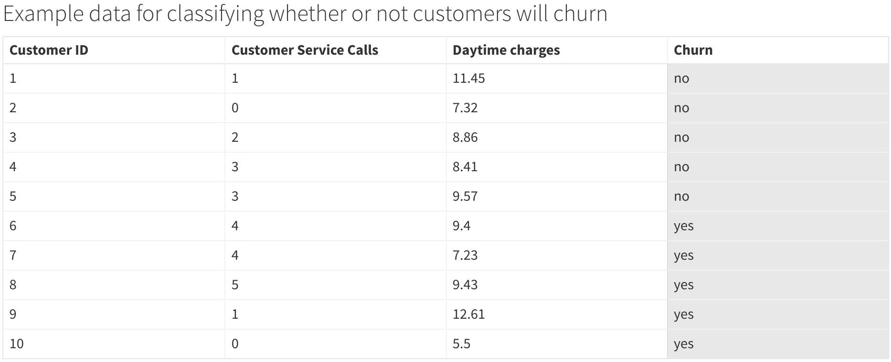

```{r setup, include=FALSE}
knitr::opts_chunk$set(echo = TRUE, eval = F)
```

# Technical setup

This section explains the software dependencies required to run the code in this course.

## R version and OS

```{r}
R.version
```

## Java version

```{r}
system("java --version")
```

## Install package dependencies from CRAN

```{r, eval = F}
install.packages("h2o")
```

## Load packages

```{r}
library(h2o)
```

# Introduction

## About this course

In this course, you'll learn how to train and evaluate machine learning models using R and H2O, two of the premier open source frameworks for data science and machine learning. The course is primarily focused on teaching applied machine learning, although some theory and key concepts are introduced to provide a foundation for learning. 

You'll learn how to build regression and classification models that are accurate, scalable, insightful, and easy to implement. For classification, you will study, implement, and compare algorithms that predict whether or not a customer will churn. For regression modeling, you will follow a similar pattern to predict future healthcare costs for a sample of individuals. You will have access to playgrounds to practice coding the stages of a machine learning workflow including data preparation, algorithm selection, and accuracy evaluation.

This course will teach you how to build models properly to ensure accuracy and reliability. Techniques such as hyerparameter tuning, cross validation, and ensembling are deployed for this purpose.

## Why you should choose this course

After this course, you will be equipped with the knowledge to do the following.

- Complete industry-level machine learning projects with high accuracy.

- Compete in machine learning competitions.

- Add machine learning projects and skills to your professional portfolio or resume.

## Target audience

This course is intended for anyone interested in applying machine learning to real-world data sets. Basic knowledge of the R programming language and data analysis are expected. Because this course is focused on applied machine learning, knowledge of the theory or mathematics behind machine learning is not required.

## What you will learn

This course covers the following topics.

- H2O and the R client
- Classification
- Regression
- AutoML
- Hyperparamter tuning
- Evaluating accuracy
- Selecting a final model
- Evaluating important features
- Visualizing predictions

## About the author

Danny Morris is a Principal Data Scientist with extensive experience in building and deploying machine learning models in industry. He has built models for the following business problems.

- Customer churn
- Sales forecasting
- Insurance claims forecasting
- Customer segmentation
- NLP text similarity
- Image recognition
- Disease propensity modeling

# Overview of machine learning

## About machine learning

Machine learning uses past data and algorithms to learn complex patterns and predict outcomes at scale.

## Primary goals of machine learning

The following list highlights some of the most promising goals of machine learning.

- **Prediction accuracy**: Machine learning is highly capable of predicting outcomes with great accuracy. High levels of accuracy are possible due to the increasing sophistication of the algorithms and techniques developed by the machine learning community. Generally speaking, greater amounts of data lead to more accurate models. Note that some machine learning algorithms are more capable of achieving higher levels of accuracy than others.

- **Scalability**: Machine learning is highly capable of scaling to large and complex datasets with minimal effort required of the user. For example, a single machine learning algorithm can learn to predict sales for thousands of food items at approximately the same time. Additionally, with tools like H2O machine learning models can be distributed across many systems to achieve massive scale. Note that some algorithms are more capable of scaling than others.

- **Explainability**: Machine learning is capable of identifying and explaining patterns in the data to help better understand predictions. For example, machine learning can reveal the degree to which price and experience influence customer loyalty. Note that some machine learning algorithms are more capable of explaining patterns than others.

## The machine learning workflow

The machine learning workflow involves the following steps.

1. **Analyze and prepare data**: Raw data needs to be collected and prepared for machine learning. Common data analysis and preparation steps include analysis of missing values, data types, and class distributions.

2. **Select an algorithm**: One or more algorithms are chosen depending on the goals of the project. As you will learn, some algorithms are generally more accurate than others.

3. **Prepare the hyperparameter tuning strategy**. Hyperparameters are algorithm-specific parameters that greatly influence accuracy. Configuring a proper hyperparameter tuning strategy can lead to significant gains in accuracy.

4. **Train models**: Given the data, algorithms, and hyperparameter tuning strategy have been chosen and prepared, it is time to train models. Depending on several factors, such as the algorithm and the number of hyperparameters being tuned, training can be expensive in terms of time and computational resources. A technique called early stopping can be used to limit training time without compromising accuracy.

5. **Select the most accurate model**: The training phase can produce tens, hundreds, or even thousands of models depending on the chosen algorithms and the hyperparameter tuning strategy. A key step is choosing the best model from many candidate models.

6. **Evaluate accuracy**: The chosen model is put through a series of rigorous tests to estimate its true accuracy. Ideally, the chosen model will pass all tests and solidify its status as the best model. 

7. **Describe the final model**: With the best and final model in hand, further exploratory analysis can be performed to describe and explain the details of the model. For example, feature importances may be obtained to quantify the degree to which each feature influences the predictions. 

## About H2O

H2O is recognized as one of the leading providers of open source machine learning software. The core code of H2O is written in Java, though client packages exist for R and other languages. The accuracy, selection, speed, and scalability of H2O's algorithms make it ideal for machine learning projects in industry. 

Below is a list of benefits to using H2O for machine learning.

- Free to use.

- Contains implementations of several state-of-the-art classification and regression algorithms.

- Client package available in R.

- Simple and consistent API interface.

- Highly scalable due to the ability to run distributed workloads.

## About R

R is among the most popular open-source programming languages for data science and analytics. Because machine learning projects typically involve a significant amount of data analysis, R is a naturl fit for machine learning.

Below is a list of benefits of the R programming language.

- Free to use.

- Integrates with H2O via the R client package.

- Already being widely used to collect, reshape, and explore datasets at scale.

- Capable of generating reports, including machine learning workflows, using R Markdown.

## Example machine learning use cases

In industry, machine learning drives many functions including customer retention, cost forecasting, and more. Business problems that are ideal for machine learning include the following.

- **Customer churn**: Machine learning is used to predict which customers are most likely to cancel a service or switch products. For example, marketing organizations develop retention campaigns targeted at customers with a high likelihood of switching brands. Predictors of this outcome include the price of the service or product, customer experience, and customer demographics. 

- **Healthcare costs**: Machine learning is used to predict or forecast healthcare costs. For example, health insurance companies predict an individual's future healthcare costs to help guide care and manage the financials. Predictors of this outcome include prior healthcare costs, diagnoses, medications, and demographics.

- **Sales forecasting**: Machine learning is used to predict or forecast sales associated with one or more products or services. For example, food distributors use machine learning to predict future sales for thousands of goods to help with planning. Predictors of this outcome include prior sales, season of the year, and price.

## Quiz

1. Which of the following is not a goal of machine learning?
    - Prediction accuracy
    - Scaling to large and complex datasets
    - Explaining patterns
    - Hypothesis testing (correct)

2. All machine learning algorithms are capable of achieving the same levels of accuracy?
    - True
    - False (correct)
    
3. A machine learning model learns that high prices decrease customer loyalty. Which machine learning goal does this achieve?
    - Prediction accuracy
    - Scalability
    - Explainiability (correct)
    
4. Machine learning algorithms require a sufficient amount of past data in the proper format to learn patterns and make predictions.
    - True (correct)
    - False

6. How many models are constructed during the model training phase?
    - 1
    - 100
    - It depends on several factors including the choice of algorithms and its configuration. (correct)
    
7. Machine learning models undergo a series of rigorous tests to estimate the true accuracy of the model.
    - True (correct)
    - False
  
8. Once a final machine learning model has been selected and fully tested, what additional exploratory analysis can be performed to describe and explain the model?
    - Evaluate alternative algorithms
    - Evaluate important features (correct)
    - Evaluate alternative testing strategies
    
9. How does R integrate with H2O?
    - Through a R client package (correct)
    - Through Java scripts
    - Through a web API
    
10. Which of the following is a reason to use H2O for machine learning. Select all that apply.
    - Contains implementations of several state-of-the-art algorithms. (correct)
    - Highly scalable due to ability to run distributed workfloads. (correct)
    - The R client package provides a simple and consistent interface. (correct)

# Key machine learning concepts {#ml-key-concepts}

This section explains key machine learning concepts. 

## Classification

Classification algorithms predict discrete outcomes. For example, classification algorithms can be used to predict whether or not a customer will stop using a product or service. *Binary classification* is the case when there are exactly two classes (e.g. customer did or did not stop using the product). Multiclass classification extends to more than two classes, although binary classification is very commmon in industry.



## Regression

Regression algorithms predict continious oucomes. For example, regressors are used to predict an individual's future healthcare costs.


## Target variable

Also known as the dependent variable, the target variable is the outcome you are attempting to predict using machine learning. For example, the target variable in a customer churn problem is often a binary outcome with values "Yes" (the customer did churn) and "No" (the customer did not churn).

## Features

Also known as independent variables, features are variables in the data set which are used to predict the target variable. For example, product price and product ratings are commonly used features for predicting customer churn.


Features are either *numeric* or *categorical*. Numeric features contain quantities and categorical features contain discrete categories. Example numeric features include price (in currency) and age (in years). Example categorical features include country (India, United States, Other) and education level (PhD, Masters, Other).

## Instances

Also known as observations, instances are individual examples of the units in the data. For example, in a customer churn problem a single customer represents an instance.

## Training

Training is the process of teaching a machine learning algorithm to learn patterns and predict outcomes using data. During training, machine learning engineers experiment algorithms, features, and various techniques to maximize accuracy. 

A signifcant percentage (e.g. 70%) of the original dataset is used for training. To avoid overfitting, the training data should used for no other purpose than training. 

## Validation 

Validation is the process of estimating accuracy throughout the training phase. A small percentage (e.g. 15%) of the original dataset is used for validation. The validation and training data should have zero overlap. When there is overlap, accuracy estimates are less reliable, which can result in an inferior model.

## Testing

Testing is the process of estimating the true accuracy of the model in a real, production setting. Once the final algorithm has gone through proper training and validation, testing is done to verify the model's performance. A small percentage (e.g. 15%) of the original dataset is used for testing. 

Note that model testing should occur very infrequently to avoid overfitting. If done too frequently using the same partition of data, the risk of overfitting the model to the testing data is higher, which could result in an inferior model.


## Predicted values

Predicted values are values for the target variable that are predicted by the machine learning model.

## Actual values

Actual values are values for the target variable that are present in the original dataset.


## Missing values

Missing values are values in the dataset that are not available. Missing values are often encoded as `NA` in R. 

When there are missing values in the data, a decision must be made regarding their treatment. The following treatments are commonly used.

- Remove instances that contain any missing values. This may be acceptable if the dataset contains relatively few missing values.

- Replace the missing values with another value. For numeric features, missing values may be replaced with the feature's mean value. This is known as *mean imputation*. For categorical features, missing values may be replaced with the most frequent value. This is known as *mode imputation*. Imputation may be acceptable if the dataset contains relatively few missing values.

- Create new features that flag the presence or absence of missing values. This technique assumes that missing values contain meaningful information.


## Feature importance

Feature importance is a measure of the relative influence of each feature on prediction accuracy. Feature importances are calculated differently depending on the algorithm. For example, the feature importances in a Linear Regression model report the linear coefficients. In a Gradient Boosted Tree, feature importances reflect the degree to which each feature contributes to improvements in accuracy. Feature importances are useful for identifying features that heavily influence the target variable.


## Overfitting

Overfitting occurs when a machine learning algorithm performs well on training data but poorly on holdout data. Strategies such as regularization, cross validation, and hyperparameter tuning exist to prevent overfitting.


## Cross validation

Cross validation is a training strategy for rigorously evaluating the accuracy of a machine learning model and preventing overfitting. In essence, cross validation is a strategy for testing a machine learning algorithm on several partitions of holdout data. Testing a model on several partitions of holdout data instead of a single partition helps to avoid overfitting and results in more robust estimates of accuracy. 

Cross validation is done by partitioning several training and holdout datasets from the original dataset. Each partition is known as a **fold**. Within each fold, training and testing are performed in the normal way. Once all folds are exhausted, accuracy metrics and predictions from the individual folds are aggregated to produce overall accuracy metrics.

Below is an illustration of cross validation. Notice that within each fold, a partition of the original dataset is used for testing and the remaining data are used for training.


## Hyperparameter tuning

Hyperparameter tuning is a strategy for training a highly accurate model. Hyperparameters are algorithm-specific, user-defined settings that can greatly impact model accuracy if not set correctly. Furthermore, some algorithms have thousands of hyperparameter combinations. Therefore, an efficient hyperparameter tuning strategy is often necessary to train an accurate model.

In this course, you will learn about **random grid search**. Random grid search samples the entire space of hyperparameters randomly and uniformly until a high-performing subset of hyperparameter emerges. Unlike traditional grid search, which evaluates all possible combinations of hyperparameter values, random grid search leads to faster training times and high accuracy.

The **hyperparameter tuning grid** is a matrix of hyperparameters and their values you intend to tune in order to discover the subset of values that produces the greatest accuracy. 


## Early stopping

Early stopping is a technique for limiting the time spent on model training. Without early stopping, model training times can become quite lengthy depending on the complexity of the algorithm and the dataset.

Early stopping can be achieved by intentionally limiting training time (e.g. stop at 2 minutes) or by configuring the algorithm to cease training when accuracy stops improving.

Early stopping applies to both hyperparameter tuning and model training. Early stopping occurs during hyperparameter tuning when testing more hyperparameter combinations fails to yield improvements in model accuracy. Early stopping occurs during model training when additional training fails to yield improvements in model accuracy.


## Ensembling

Ensembling is the process of combining predictions from multiple models to form a more accurate model. Because individual algorithms have unique strengths, ensembles combine their strengths to produce a better model. Ensemble models are often the winning architecture in machine learning competitions.

## Quiz

1. Which machine learning technique is used to predict discrete outcomes, such as whether or not a customer will churn?
    - Regression
    - Classification (correct)

2. What is the term for the variable in the dataset which you interested in predicting?
    - Instances
    - Features
    - Target variable (correct)

3. Which partition of the dataset is passed to the machine learning algorithm to learn patterns?
    - Training (correct)
    - Validation
    - Testing

4. Which partition of the dataset is used to periodically evaluate and tune the machine learning algorithm?
    - Training
    - Validation (correct)
    - Testing

5. The testing data should be used to verify accuracy only once.
    - True (correct)
    - False

6. What is it called when the machine learning algorithm performs well on the training data but not on the validation or testing data?
    - Overfitting (correct)
    - Cross validation
    - Early stopping

7. Allowing the training, validation, and testing datasets to overlap does not increase the likelihood of overfitting.
    - True
    - False (correct)

8. What are the benefits of hyperparameter tuning? Select all that apply.
    - Reduce the likelihood of overfitting (correct)
    - Discover the best hyperparameter values (correct)
    - Maximize accuracy (correct)
    - Reduce the time spent testing hyperparameters manually (correct)

9. What is the name of the technique that helps to reduce training times by ceasing training and hyperparameter tuning once no further improvements in accuracy are made?
    - Cross validation
    - Hyperparameter tuning
    - Early stopping (correct)

10. Cross validation involves training and testing machine learning algorithms on several unique partitions of the data to generate robust estimates of accuracy.
    - True (correct)
    - False

11. What is it called when more than one models or algorithms are combined to improve accuracy.
    - Regression
    - Early stopping
    - Ensembling (correct)

12. Which of the following options is not used to handle missing values?
    - Replace missing values with the feature mean (mean imputation).
    - Create new features that flag the presence or absence of missing values.
    - Remove instances or features that contain many missing values.
    - Replace missing values with a random value. (correct)

13. Which hyperparameter tuning strategy leads to faster training times when the entire space of hyperparameter combinations is large?
    - Traditional grid search
    - Random grid search (correct)
    
14. What is a hyperparameter tuning grid?
    - A list of all hyperparameters associated with all of H2O's algorithms.
    - The subset of hyperparameter values that produce the greatest accuracy.
    - A matrix of hyperparameters and their values that you intend to tune in order to discover the most accurate subset. (correct)

15. Feature importances reflect the influence of each feature on prediction accuracy.
    - True (correct)
    - False

# Algorithms

This course emphasizes three types of machine learning algorithms including Generalized Linear Model, Gradient Boosted Trees, and AutoML. 

Though many other machine learning algorithms exist, these three algorithms are widely used in industry. Each algorithm possesses unique strengths and weaknesses.

## Generalized Linear Model (GLM)

### About

Generalized Linear Models (GLM) are a family of algorithms that seek to calculate predictions from a linear combination of the features. For example, GLMs can be used to predict the expected increase in an individual's healthcare costs when the individual's age increases by one year.

GLMs are suitable for classification and regression problems. For regression, **Linear Regression** is commonly used. 

### Linear regression

For regression, **Linear Regression** is commonly used.

### Logistic regression

For classification, **Logistic Regression** is commonly used.

### Strengths

- Very fast training times.

- High potential for explainability.

- Very few hyperparameters to tune.

### Weaknesses

- Less capable of discovering non-linear relationships between features and target variable.

- Less capable of high prediction accuracy.

- Sensitive to data issues including missing values, outliers, and correlated features.

## Gradient Boosted Trees

Gradient Boosted Trees are a rules-based algorithm that predicts outcomes through the construction of decision rules. For example, Gradient Boosted Trees may construct a rule stating that customers with an expensive subscription and poor customer service are predicted to churn. 

Gradient Boosted Trees are ensemble algorithms, which means that a Gradient Boosted Tree model is constructed from several individual decision trees. Each individual tree in the ensemble attempts to improve upon the mistakes of the previous trees. Therefore, individual trees are not independent. Individual trees are aggregated to form a robust ensemble model with a higher potential for accuracy compared to the individual trees. 

Gradient Boosted Trees are suitable for classification and regression problems.

<h3>Illustration of a single decision tree. Gradient Boosted Trees deploy an ensemble of trees to optimize accuracy.</h3>


### Strengths

- Very high potential for accuracy.

- Capable of discovering complex, non-linear relationships between features and target variable.

- Less sensitive to data issues such as missing values, outliers, and correlated features.

### Weaknesses

- Potential for long training times.

- Moderately large number of hyperparameters to tune. 

- Less capable of explainability.

## AutoML

Automatic Machine Learning (AutoML) is the process of training and testing several algorithms on the same dataset to automatically discover a high-performing algorithm. For example, AutoML can be used to train various regression algorithms, including GLMs, Gradient Boosted Trees, and Neural Networks, to determine which algorithm performs the best. AutoML is ideal for engineers with no machine learning experience, and it is also ideal for experienced machine learning engineers who are starting a new project.

AutoML is suitable for classification and regression problems.

### Strengths

- Easy to implement without prior machine learning knowledge.

- Easy to test a variety of algorithms with minimal effort.

- Capable of discovering a high quality model with minimal effort.

### Weaknesses

- Potential for long training times.

- Hyperparameter tuning not supported. 

- Less capable of explainability.

## Quiz

1. Which machine learning algorithm allows you to discover a high-performing algorithm with minimal effort?
    - Generalized Linear Model
    - Gradient Boosted Trees
    - AutoML (correct)

2. Generalized Linear Models use a sequence of decision trees to construct rules-based predictions.
    - True
    - False (correct)

3. Generalized Linear Models are known for being fast, explainable, and generally accurate.
    - True (correct)
    - False

4. The individual trees in a Gradient Boosted Trees algorithm are constructed to improve upon the mistakes of the previous trees.
    - True (correct)
    - False 

5. Which of the following options is a strength of the Gradient Boosted Tree algorithm? Select all that apply.
    - High accuracy (correct)
    - Automatically handles non-linear interactions between the features and the target variable. (correct)
    - Less sensitive to data issues such as outliers, missing values, and correlated features. (correct)
    - Very few hyperparameters to tune

6. Which of the following options is a strength of the Generalized Linear Model algorithm? Select all that apply.
    - Very fast training times (correct)
    - Very few hyperparameters to tune (correct)
    - Automatically handles non-linear interactions between the features and the target variable.
    - Less sensitive to data issues such as outliers, missing values, and correlated features.

# Classification modeling

## Objective

In this secetion, you will learn about classification. In the first section, you will learn key concepts. In the later sections, you will learn how to implement classification modeling using R and H2O. Several playgrounds are provided to encourage an interactive experience.

## Prerequisites

1. Review the key machine learning concepts

## Key concepts {#clf-key-concepts}

### Accuracy metrics

The following metrics for classification accuracy are covered in this section.

#### Metrics derived from predicted classes

Because Logistic Regression predicts class probabilities by default, a *classification threshold* is required in order to convert probabilities into discrete classes. By default, H2O will find optimal classification thresholds for a variety of metrics.

- **F1**: F1 score intends to strike a balance between Precision and Recall. Because Precision and Recall each have strengths and weaknesses, F1 score is often a good metric to optimize. F1 scores range from 0 to 1. Values closer to 1 are preferred. See the [F1]() documentation for more details.

- **F2**: See the [F2]() documentation for more details.

- **F0.5**: See the [F0.5]() documentation for more details. 

- **Precision**: Precision measures the proportion of predicted positive values that are actual positive values. For example, if a machine learning model predicts 100 customers will churn and 90 customers actually churned, then precision equals 0.9. Precision values range from 0 to 1. Values closer to 1 are preferred.

- **Recall**: Recall measures the proportion of actual positive values that are predicted by the model to be positive. For example, if a data set contains 100 customers who actually churned and 70 were correctly predicted to churn, then recall equals 0.7. Recall values range from 0 to 1. Values closer to 1 are preferred.

- **Misclassification rate**: Also known as "accuracy", misclassification rate measures the proportion of actual values that are correctly predicted regardless of class. Though intuitive, misclassification rate is often not a useful metric because it is highly sensitive to class imbalance. Misclassification rates range from 0 to 1. Values closer to 1 are preferred. 

#### Metrics derived from predicted probabilities

Metrics derived from predicted probabilities assess how well probabilities align with the actual class values. In an accurate model, instances with a high predicted probability of belonging to class *X* should actually belong to class *X*.

- **AUC**: Measures model performance aggregated across the entire range of predicted probabilities. Values closer to 1 are preferred. See the [AUC]() documentation for more details.

- **AUCPR**: (Area Under the Precision-Recall Curve): See the [AUCPR]() documentation for more details.

- **LogLoss**: See the [LogLoss]() documentation for more details.

### Postive and negative classes

In classification modeling, classes are the groups represented in the target variable. In a customer churn problem, the customers who did churn represent the positive class and the customer who did not churn represent the negative class.

### True positives, false positives, true negatives, and false negatives

| Result     | Description |
| -----------| ----------- |
| True positive   | The predicted and actual values are both positive. |
| False positive  | The predicted value is positive but the actual value is negative. |
| True negative   | The predicted and actual values are both negative. |
| False negative  | The predicted value is positive but the actual value is negative. |

### Class balance

Class imbalance occurs when the number of instances is one class greatly outweighs the number of instances in the opposite class. For example, a data set containing 100 positive instances and 1,000 negative instances would gernally be viewed as imbalanced. 

Imbalanced data may present a risk since the majority class can easily overwhelm the minority class if the imbalance is severe enough. A common remedy for imbalanced classes is to balance the data during the training phase. Balancing classes is done by either oversampling the minority class (i.e. artificially increasing the amount of data until balance is achieved) or undersampling the majority class (i.e. artificially decreasing the amount of data until balance is achieved).

### Quiz

1. Which of the following metrics are derived from predicted classes? Select all that apply.
    - AUC
    - F1 (correct)
    - Accuracy (correct)
    - Precision (correct)

2. Which of the following accuracy metrics are derived from predicted probabilities? Select all that apply.
    - AUC (correct)
    - Recall
    - LogLoss (correct)
    - AUCPR (correct)

3. If customers who churn represent the positive class, what is an example of a true positive prediction?
    - A customer churned and was predicted to churn. (correct)
    - A customer did not churn but was predicted to churn.
    - A customer did not churn and was not predicted to churn.

4. If customers who churn represent the positive class, what is an example of a false positive prediction?
    - A customer churned and was predicted to churn.
    - A customer did not churn but was predicted to churn. (correct)
    - A customer did not churn and was not predicted to churn.

5. What is it called when the number of instances is one class greatly outweighs the other class?
    - Overfitting
    - Class imbalance (correct)
    - False negative

6. True or False: Oversampling the minority class and undersampling the majority class are two techniques for dealing with class imbalance.
    - True (correct)
    - False

## Prepare customer churn data {#prep-churn}

### Connect to local H2O cluster

In this section, you will launch a local H2O cluster in order to use H2O's algorithms. Run the `h2o.init` function from the `h2o` package to initialize an H2O cluster on your local machine. By default, H2O uses all available CPUs to maximize speed and efficiency.

```{r}
h2o.init()
```

### Import data into H2O cluster

Use the `h2o.importFile()` function to import the local CSV file into the local H2O cluster. To use H2O's algorithms, the data must be available in the H2O cluster.

```{r}
churn_h2o <- h2o.importFile(path = "churn.csv")
```

The `churn_h2o` should be an `H2OFrame`, which is efficient and ideally suited for H2O's algorithms. An `H2OFrame` is H2O's equivalent of an R `data.frame`. 

Use the `class()` function verify the data type is `H2OFrame`.

```{r}
class(churn_h2o)
```

### Report the number of rows and columns

Use the `h2o.dim()` function to report the dimensions of the `H2OFrame`.

```{r}
h2o.dim(churn_h2o)
```

### Profile the variables

To better understand the variables in the `H2OFrame`, use the `h2o.describe()` function. The summary table includes important information about each variable in the dataset including the data type, missing values, numeric summaries, and the number of categories in each categorical varaible.

```{r}
churn_profiles <- h2o.describe(frame = churn_h2o)

# Print the summary table for the first 10 variables.
head(churn_profiles, 10)
```

### Inspect data types

Using the `churn_profiles` object, run the `table()` function on the column `Type` to count the number of variables by data type.

```{r}
table(churn_profiles["Type"])
```

### Evaluate missing values

Though H2O is capable of handling `NA` values with ease, it is important to detect any columns that contain a sufficiently large number of `NA` values.

Using the `churn_profiles` object, apply a filter to the column `Missing` to detect variables with at least one missing value.

```{r}
churn_profiles[churn_profiles["Missing"] > 0, ]
```

There are no features in this dataset with missing values.

### Evaluate class balance

Assess the distribution of the target variable `churn` by calculating the number of instances belonging to the positive and negative classes. To do this, apply the `h2o.table()` function `churn` column of the `H2OFrame`. 

```{r}
h2o.table(churn_h2o["churn"])
```

This dataset contains 598 instances of the positive class (14%) and 3,652 instances of negative class (86%). While there are no strict rules for categorizing the degree of imbalance, the author would consider this dataset *moderately imbalanced*. During model training, you will have the opportunity to balance classes and observe the effects.

### Partition training, validation, and testing splits

The next step in the data preparation workflow is to partition the original `H2OFrame` object `churn_h2o` into three datasets: training, validation, and testing. Use the `h2o.splitFrame()` function to partition the `H2OFrame`.

In this example, the ratios are as follows.

- 70% of the data for training

- 15% for validation

- The remaining 15% for testing

```{r}
churn_splits <- h2o.splitFrame(
  data = churn_h2o,
  ratios = c(0.7, 0.15),
  seed = 1
)
```

To alter the percentage of data allocated to each of the three partitions, adjust the `ratios` argument accordingly. For example, `ratios = c(0.6, 0.2)` will allocate 60% for training, 20% for validation, and the remaining 20% for testing.

Because the `churn_splits` object is an R list, the individual partitions can be extracted using the `[[ ]]` convention.

```{r}
churn_train <- churn_splits[[1]]
churn_validate <- churn_splits[[2]]
churn_test <- churn_splits[[3]]
```

Use the `nrow()` function to print the number of instances in each partition.

```{r}
nrow(churn_train)
nrow(churn_validate)
nrow(churn_test)
```

### Specify feature and target variables

The final step of data preparation is to specify the names of the target variable and the features you intend to use in your model. To use all features, use the `setdiff()` function to retrieve the names of all variables except for the target variable `churn`. Alternatively, explicitly list the feature names using the convention `features <- c("state", "account_length", "...")`

```{r}
target <- "churn"

features <- setdiff(
  x = names(churn_h2o),
  y = "churn"
)
```

### Quiz

1. The `h2o.init()` function is used to initialize and connect to a local H2O cluster from R.
    - True (correct)
    - False

2. Which of the following functions is used to import a local file (e.g. CSV) into the H2O cluster?
    - `h2o.importCSV()`
    - `h2o.importLocal()`
    - `h2o.importFile()` (correct)

3. What is H2O's equivalent of an R `data.frame`?
    - `H2O.data.frame`
    - `H2O.df`
    - `H2OFrame` (correct)

4. Which of the following functions is used to summarize the individual variables in a `H2OFrame`?
    - `h2o.profile()`
    - `h2o.describe()` (correct)
    - `h2o.summarize()`

5. Given an `H2OFrame` named `my_frame`, which of the following expressions will calculate the number of instances belonging to the categorical variable named `target`?
    - `h2o.countInstances(my_frame["target"])`
    - `h2o.table(my_frame["target"])` (correct)
    - `table(my_frame$target)`

6. Using the function `h2o.splitFrame` to partition training, validation, and testing datasets from a `H2OFrame`, which of the following configurations of the `ratios` argument will allocate 80% for training, 10% for validation, and 10% for testing.
    - `ratios = c(0.8, 0.1)` (correct)
    - `ratios = c(0.8, 0.2)`
    - `ratios = c(0.7, 0.1)`

### Playground

In this playground, you will explore the code to prepare the customer churn data for machine learning.

```{r}
##################################
## Connect to local H2O cluster ##
##################################

# Use the h2o.init() to initialize a local H2O cluster and connect .

h2o.init()

# Consult the function documentation to learn more.

help(h2o.init)

#######################################
## Import local CSV into H2O cluster ##
#######################################

# Use the `h2o.importFile()` function to import the local CSV into the local H2O cluster.

churn_h2o <- h2o.importFile(path = "churn.csv")

# Check the class of the object. Should be `H2OFrame`.

class(churn_h2o)

###########################################
## Report the number of rows and columns ##
###########################################

# Use the `h2o.dim()` function to report the dimensions of the `H2OFrame`

h2o.dim(churn_h2o)

###########################
## Profile the variables ##
###########################

# To better understand the variables in the `H2OFrame`, use the `h2o.describe()` function. The summary table includes important information about each variable in the dataset including the data type, missing values, numeric summaries, and the number of categories in each categorical varaible.

churn_profiles <- h2o.describe(frame = churn_h2o)

# Print the summary table for the first 10 variables.

head(churn_profiles, 10)

#############################
## Evaluate missing values ##
#############################

# Using `churn_profiles`, apply a filter to the column `Missing` to detect variables with at least one missing value.

churn_profiles[churn_profiles["Missing"] > 0, ]

############################
## Evaluate class balance ##
############################

# Use the `h2o.table()` function calculate the number of instances belonging to each class.

h2o.table(churn_h2o["churn"])

########################################################
## Partition training, validation, and testing splits ##
########################################################

# Use the `h2o.splitFrame()` function to partition the three distinct datasets. Adjust the `ratios` argument to alter the percentage of data allocated to each of the three partitions. Example: `ratios = c(0.6, 0.2)` will allocate 60% for training, 20% for validation, and the remaining 20% for testing.

churn_splits <- h2o.splitFrame(
  data = churn_h2o,
  ratios = c(0.7, 0.15),
  seed = 1
)

# Because the `churn_splits` object is an R list, the individual partitions can be extracted using the `[[ ]]` convention.

churn_train <- churn_splits[[1]]
churn_validate <- churn_splits[[2]]
churn_test <- churn_splits[[3]]

# Use the `nrow()` function to print the number of instances in each partition.

nrow(churn_train)
nrow(churn_validate)
nrow(churn_test)

##########################################
## Specify features and target variable ##
##########################################

# target variable
target <- "churn"

# To use all features, use the `setdiff()` function to retrieve the names of all variables except for the target variable `churn`. Alternatively, explicitly list the feature names using the convention `features <- c("state", "account_length", "...")`

features <- setdiff(
  x = names(churn_h2o),
  y = "churn"
)
```

## Logistic Regression 

The first classification algorithm you will train and evaluate is Logistic Regression.

### Prerequisites

To proceed with Logistic Regression modeling, be sure to complete the previous sections.

- [Machine learning key concepts](#ml-key-concepts)

- [Classification modeling key concepts](#clf-key-concepts)

- [Prepare customer churn data](#prep-churn)

### Prepare hyperparameter tuning grid

For the Logistic Regression algorithm, you will tune the following hyperparameters.

- `alpha` is a regularization hyperparameter that helps to avoid overfitting. Values range from 0 to 1. Values closer to 0 result in more Ridge regularization, whereas values closer to 1 result in more Lasso regularization. See the [alpha]() documentation for more details.

- `lambda` is another regularization hyperparameter that influences the overall amount of regularization. Values range from 0 to 1. Values closer to 1 result in greater amounts of regularization. See the [lambda]() documentation for more details.

```{r}
logistic_regression_hp_grid <- list(
  alpha = c(0.01, 0.1, 0.3, 0.5, 0.7, 0.9, 1),
  lambda = c(1, 0.5, 0.1, 0.01, 0.001, 0.0001, 0.00001, 0)
)
```

### Define hyperparameter tuning strategy

For the Logistic Regression algorithm, your hyperparameter tuning strategy will use the following settings.

- `strategy = "RandomDiscrete` specifies random grid search. When random search is used, H2O randomly and uniformly samples hyperparameter values from the entire hyperparameter space until a high-performing subset of hyperparameter is found.  Random grid search is the recommended strategy for efficiently searching large hyperparameter subspaces. See the [grid search]() documentation for more details.

- `max_runtime_secs` specifies the amount of time (in seconds) hyperparameter tuning is permitted to run. Smaller values will shorten training time at the risk of failing to discover the best possible model. See the [max_runtime_secs]() documentation for more details.

- `stopping_metric` specifies the metric to use for early stopping. The default value of `AUTO` will use the logloss metric for classification. See the [stopping_metric]() documentation for more details.

- `stopping_tolerance` specifies the minimum required improvement in the stopping metric before training ceases. Larger values will require greater amounts of improvement in the stopping metric for training to continue. See the [stopping_tolerance]() documentation for more details.

- `stopping_rounds`. See the [stopping_rounds]() documentation for more details.

- `seed`. See the [seed]() documentation for more details.

```{r}
logistic_regression_hp_strategy = list(
  strategy = "RandomDiscrete", 
  max_runtime_secs = 60, 
  stopping_metric = "AUTO", 
  stopping_tolerance = 0.001, 
  stopping_rounds = 5, 
  seed = 123456
)
```

### Specify feature interactions

Unlike other algorithms, Logistic Regression is incapable of accounting for feature interactions automatically. Therefore, any feature interactions must be specified explicitly. 

In this section, you will allow five features to interact: `total_day_charge`, `total_eve_charge`, `total_night_charge`, `total_intl_charge`, `number_customer_service_calls`. During training, H2O will automatically create new features by computing all pairwise combinations of the features allowed to interact.

```{r}
logistic_regression_interactions <- c(
  "total_day_charge", 
  "total_eve_charge", 
  "total_night_charge", 
  "total_intl_charge",
  "number_customer_service_calls"
)
```

### Train models

In this section, you will train several models at once using hyperparameter tuning and cross validation. The result will be a "grid" of models. Each model in the grid will be linked to a distinct subset of hyperparameters. Accuracy metrics are generated for each subset of hyperparameter values, and the subset that produces the most accurate model will be selected and described in the sections that follow.

To train the models, use the `h2o.grid()` function with the following arguments.

- `algorithm`

- `grid_id`

- `x`

- `y`

- `training_frame`

- `nfolds`

- `keep_cross_validation_predictions`

- `stopping_rounds`

- `stopping_tolerance`

- `stopping_metric`

- `hyper_params`

- `search_criteria`

- `family`

- `standardize`

- `balance_classes`

- `interactions`

- `seed`

```{r, eval = F}
logistic_regression_grid_search <- h2o.grid(
  algorithm = "glm",
  grid_id = "logistic_regression_churn",
  x = features,
  y = target,
  training_frame = churn_train,
  validation_frame = churn_validate,
  interactions = logistic_regression_interactions,
  hyper_params = logistic_regression_hp_grid,
  search_criteria = logistic_regression_hp_strategy,
  family = "binomial",
  standardize = TRUE,
  balance_classes = TRUE,
  stopping_rounds = 5,
  stopping_tolerance = 0.001,
  stopping_metric = "AUTO",
  seed = 123456
)
```

```{r, eval = F, echo = F}
# save model
h2o.saveGrid(
  grid_directory = "models/logistic-regression-churn",
  grid_id = "logistic_regression_churn"
)
```

```{r, eval = F, echo = F}
# Load the pretrained model from local directory to avoid retraining
logistic_regression_grid_search <- h2o.loadGrid(
  grid_path = "models/logistic-regression-churn/logistic_regression_churn"
)
```

### Select the most accurate model

At this point, you have trained several Logistic Regression models using hyperparameter tuning. To select the most accurate model, you must first sort all models from most to least accurate using the `h2o.getGrid()` function. In this example, models are sorted in descending order according to each model's F1 score. 

```{r}
logistic_regression_model_grid <- h2o.getGrid(
  grid_id = "logistic_regression_churn", 
  sort_by = "f1",
  decreasing = TRUE
)
```

To retrieve the model with the most accurate subset of hyperparameters, use the `h2o.getModel` function as shown below.

```{r}
logistic_regression_best_model <- h2o.getModel(
  model_id = logistic_regression_model_grid@model_ids[[1]]
)
```

### Report the best hyperparameter values

To report the best-performing subset of hyperparameters, call the model's `@summary_table` attribute and return the first row only.

```{r}
logistic_regression_model_grid@summary_table[1, ]
```

### Evaluate accuracy

In this section, you will evaluate the accuracy of the best-performing model using a variety of strategies. First, you will evaluate the accuracy of the model on the validation split. Second, you will evaluate the accuracy of the model on the testing split. Finally, you will evaluate the accuracy of the model using cross validation. At the end, you will judge the results and determine the model's true predictive power.

#### Custom function

The following custom function `report_classification_metrics` extracts metrics from H2O's classification algorithms. This custom function returns F1, F2, F0.5, AUC, AUCPR, and LogLoss scores. The lone argument `metrics` should be a `H2OBinomialMetrics` object.

```{r}
report_classification_metrics <- function(metrics) {
  metrics <- list(
    F1 = max(h2o.F1(metrics)[,'f1']),
    F2 = max(h2o.F2(metrics)[,'f2']),
    F0.5 = max(h2o.F0point5(metrics)[,'f0point5']),
    AUC = h2o.auc(metrics),
    AUCPR = h2o.aucpr(metrics),
    LogLoss = h2o.logloss(metrics)
  )
  return(metrics)
}
```

#### Evaluate accuracy on validation split

In this section, you will learn how to evaluate the accuracy of the model on the validation split. 
Because the validation split was used during training, these accuracy metrics may not reflect the model's true ability to perform on unseen data.

To obtain validation metrics, use the `h2o.performance` function with `valid = TRUE`. The class of the resulting object is `H2OBinomialMetrics`.

```{r}
logistic_regression_validation_metrics <- h2o.performance(
  model = logistic_regression_best_model,
  valid = TRUE
)
```

Use the custom function `report_classification_metrics` to report the validation metrics.

```{r}
report_classification_metrics(metrics = logistic_regression_validation_metrics)
```

#### Evaluate accurcy on testing split

In this section, you will learn how to evaluate the accuracy of the model on the testing split. 

Because the testing split was not used during training, these accuracy metrics reflect the model's true ability to perform on unseen data. **A reliable model will report similar accuracy for both the validation and testing splits**. If the difference between validation and testing accuracy is significant, then the model is overfit and should be retrained.

To obtain testing metrics, use the `h2o.performance` function with `newdata = churn_test`. The class of the resulting object is `H2OBinomialMetrics`.

```{r}
logistic_regression_testing_metrics <- h2o.performance(
  model = logistic_regression_best_model, 
  newdata = churn_test
)
```

Use the custom function `report_classification_metrics` to report the validation metrics.

```{r}
report_classification_metrics(metrics = logistic_regression_testing_metrics)
```

#### Evaluate accuracy using cross validation

In this section, you will deploy cross validation to make one final evaluation regarding model accuracy. By using cross validation, you are putting the model through an additional round of rigorous testing to ensure the accuracy metrics are reliable.

To evaluate accuracy using cross validation, you will retrain a new model using all instances in the training and validation splits and the same model parameters obtained previously through hyperparameter tuning. You will also deploy 5-fold cross validation.

In the following code, you are calling the `h2o.glm` function and passing the parameters obtained through hyperparameter tuning. Some tweaks are necessary, such as expanding the `training_frame`, disabling the `validation_frame`, and setting `nfolds` to a value of 5 to enable 5-fold cross validation.

```{r, eval = F}
logistic_regression_cv <- do.call(
  what = h2o.glm,
  args = {
    parameters = logistic_regression_best_model@parameters
    parameters$model_id = "logistic_regression_cv"
    parameters$training_frame = h2o.rbind(churn_train, churn_validate)
    parameters$validation_frame <- NULL
    parameters$x <- features
    parameters$nfolds = 5
    parameters$keep_cross_validation_predictions = TRUE
    parameters$seed <- 1234
    parameters
  }
)
```

```{r, eval = F, echo = F}
h2o.saveModel(
  object = logistic_regression_cv,
  path = "models/logistic-regression-churn-cv"
)
```

```{r, eval = F, echo = F}
# Load the pretrained model from local directory to avoid retraining
logistic_regression_cv <- h2o.loadModel(
  path = "models/logistic-regression-churn-cv/logistic_regression_cv"
)
```

To obtain cross validation metrics, use the `h2o.performance` function with `xval = TRUE`. The class of the resulting object is `H2OBinomialMetrics`.

```{r}
logistic_regression_cv_metrics <- h2o.performance(
  model = logistic_regression_cv,
  xval = TRUE
)
```

Use the custom function `report_classification_metrics` to report the validation metrics.

```{r}
report_classification_metrics(metrics = logistic_regression_cv_metrics)
```

#### Accuracy matrix

An accuracy matrix is a matrix of validation, testing, and cross validation accuracy metrics. Accuracy matrices can easily be created using spreadsheet software (or similar).

The following accuracy matrix shows the validation, testing, and cross validation metrics for the best-performing Logistic Regression model.

| Metric   | Validation | Testing | Cross Validation |
| :------- | :--------- | :------ | :--------------- |
| F1       | 0.667      | 0.660   | 0.660    
| F2       | 0.730      | 0.710   | 0.711
| F0.5     | 0.654      | 0.669   | 0.656
| Accuracy | 0.910      | 0.900   | 0.904
| AUC      | 0.868      | 0.862   | 0.876
| AUCPR    | 0.650      | 0.650   | 0.636
| LogLoss  | 0.250      | 0.290   | 0.269

To conclude, the validation, testing, and cross validation accuracy metrics are relatively stable, suggesting the best-performing model is reliable and not overfit to the training data.

### Visualize predictions using confusion matrix

```{r}
h2o.confusionMatrix(
  object = logistic_regression_testing_metrics
)
```

### Obtain predicted values 

```{r}
logistic_regression_testing_predictions <- h2o.predict(
  object = logistic_regression_best_model,
  newdata = churn_test
)
```

### Evaluate important features

To assess which features are most important to the best Logistic Regression model, use the `h2o.varimp_plot()` function to visualize feature importances.

```{r}
h2o.varimp_plot(
  model = logistic_regression_best_model,
  num_of_features = 10
)
```

Because this course is focused on maximizing prediction accuracy, no attempt is made to draw inferences about the strength and direction of the relationships between each feature and the target. 

### Playground 

In this playground, you will experiment with the code to train and evaluate your own Logistic Regression model. If necessary, revisit the section [Prepare customer churn data](#prep-churn) to improve your understanding of the data preparation phase.

```{r}
##################################
## Connect to local H2O cluster ##
##################################

# This section demonstrates how to initialize and connect to a local H2O cluster.

h2o.init()

#######################################
## Import local CSV into H2O cluster ##
#######################################

# This section demonstrates how to import the local CSV file into the H2O cluster.

churn_h2o <- h2o.importFile(path = "churn.csv")

########################################################
## Partition training, validation, and testing splits ##
########################################################

# This section demonstrates how to allocate data for training, validation, and testing. In this example, 70% is allocated for training, 15% for validation, and 15% for testing. 

# Experiment by varying the ratios and observe the impact on accuracy. Example `ratios = c(0.8, 0.1)`

churn_splits <- h2o.splitFrame(
  data = churn_h2o,
  ratios = c(0.7, 0.15),
  seed = 1
)

churn_train <- churn_splits[[1]]
churn_validate <- churn_splits[[2]]
churn_test <- churn_splits[[3]]

##########################################
## Specify features and target variable ##
##########################################

# This section demonstrates how to create references to the names of the target variable and the features. By default, all possible features are chosen. 

# Experiment with a smaller number of features and observe the effects. Example: `features <- c("number_customer_service_calls", "total_day_calls")` for a two-feature solution.

target <- "churn"

features <- setdiff(
  x = names(churn_h2o),
  y = "churn"
)

########################################
## Prepare hyperparameter tuning grid ##
########################################

# This section demonstrates how to prepare the hyperparameter tuning grid.

# The default hyperparameter grid spans each metric's full range of possible values using moderately large intervals. Experiment by modifying the hyperparameter tuning grid to use a more narrow range of candidate values. For example, set `lambda = seq(.0005, .002, .0001)` to target a very narrow range of `lambda` values with a median value around .001.

logistic_regression_hp_grid <- list(
  alpha = c(0.01, 0.1, 0.3, 0.5, 0.7, 0.9, 1),
  lambda = c(0, 0.00001, 0.0001, 0.001, 0.01, 0.1, 0.5, 0.9)
)

###########################################
## Define hyperparameter tuning strategy ##
###########################################

# This section demonstrates how to define the hyperparameter tuning strategy. Random grid search is the tuning strategy shown here. 

# Experiment by modifying the early stopping settings. At this stage, early stopping determines when training ceases for any given subset of hyperparameter values. Larger values for `stopping_tolerance` will demand increasingly higher levels of improvement for training to continue. Smaller values for `stopping_rounds` will demand increasing levels of accuracy in fewer ties, putting even greater pressure on the model to continuously improve at a high rate. 

logistic_regression_hp_strategy = list(
  strategy = "RandomDiscrete", 
  max_runtime_secs = 60, 
  stopping_metric = "AUTO", 
  stopping_tolerance = 0.001, 
  stopping_rounds = 5, 
  seed = 123456
)

##################################
## Specify feature interactions ##
##################################

# This section demonstrates how to specify feature interactions.

# Interactions are when the combined effect of two or more features on the target variable is greater than the effect of any individual feature. In other words, when features are in some way combined, the accuracy metrics for the final model may be superior to a model without interactions. 

# Experiment by including or excluding features, or disabling it altogether by setting this object to a value of `NULL`.

logistic_regression_interactions <- c(
  "total_day_charge", 
  "total_eve_charge", 
  "total_night_charge", 
  "total_intl_charge",
  "number_customer_service_calls"
)

##################
## Train models ##
##################

# This section demonstrates how to train and tune several Logistic Regression models.

# Tips for experimentation:

# 1. Set the arguments named `standardize` and `balance_classes` to either `TRUE` or `FALSE`. Doing so will determine whether or not the features are standardized and the classes balanced. 

# 2. Consider modifying the early stopping settings. At this stage, early stopping determines when training ceases altogether. 

# 3. Leave the original imbalanced class proportions intact by setting the `balance_classes` argument to `FALSE`. 

logistic_regression_grid_search <- h2o.grid(
  algorithm = "glm",
  grid_id = "logistic_regression_churn",
  x = features,
  y = target,
  training_frame = churn_train,
  validation_frame = churn_validate,
  interactions = logistic_regression_interactions,
  hyper_params = logistic_regression_hp_grid,
  search_criteria = logistic_regression_hp_strategy,
  family = "binomial",
  standardize = TRUE,
  balance_classes = TRUE,
  stopping_rounds = 5,
  stopping_tolerance = 0.001,
  stopping_metric = "AUTO",
  seed = 123456
)

####################################
## Select the most accurate model ##
####################################

# This section demonstrates how to return the grid of Logistic Regression models (one model per hyperparameter combination) sorted in order of best to worst F1 score. From this grid, the best model is selected.

# Tips for experimentation:

# 1. Sort models according to a different metric by setting the `sort_by` argument to another value such as `logloss`, `auc`, or `accuracy`. Run `help(h2o.getGrid)` for more information.

logistic_regression_model_grid <- h2o.getGrid(
  grid_id = "logistic_regression_churn", 
  sort_by = "f1",
  decreasing = TRUE
)

class(logistic_regression_model_grid)

# Select the top model from the sorted model grid.

logistic_regression_best_model <- h2o.getModel(
  model_id = logistic_regression_model_grid@model_ids[[1]]
)

class(logistic_regression_best_model)

###########################################
## Report the best hyperparameter values ##
###########################################

# This section demonstrates how to obtain the hyperparameter values for the best model by retrieving the top record in the `summary_table` attribute. 

logistic_regression_model_grid@summary_table[1, ]

# For exploratory purposes, review the top and bottom 5 hyperparameter and observe the range of F1 scores. 

head(logistic_regression_model_grid@summary_table, 5)
tail(logistic_regression_model_grid@summary_table, 5)

#######################
## Evaluate accuracy ##
#######################

# This section demonstrates how to report and evaluate model accuracy.

# To streamline reporting, this custom function named `report_classification_metrics` organizes the essential metrics into an R list.

report_classification_metrics <- function(metrics) {
  metrics <- list(
    F1 = max(h2o.F1(metrics)[,'f1']),
    F2 = max(h2o.F2(metrics)[,'f2']),
    F0.5 = max(h2o.F0point5(metrics)[,'f0point5']),
    Accuracy = max(h2o.accuracy(metrics)[,'Accuracy']),
    AUC = h2o.auc(metrics),
    AUCPR = h2o.aucpr(metrics),
    LogLoss = h2o.logloss(metrics)
  )
  return(metrics)
}

# Start by evaluating accuracy on the validation data. Because the validation data was also used to tune hyperparameters, the likelihood of overfitting is greater.

logistic_regression_validation_metrics <- h2o.performance(
  model = logistic_regression_best_model,
  valid = TRUE
)

report_classification_metrics(metrics = logistic_regression_validation_metrics)

# Next, put the model through cross validation to obtain another set of accuracy metrics. Ideally, validation metrics and cross validation metrics should not deviate significantly. To get cross validation metrics, extract a sample of the model's parameters to construct a call to the `h2o.glm` function. Experiment by increasing or decreasing the value of the `nfolds` parameter.

logistic_regression_cv <- do.call(
  what = h2o.glm,
  args = {
    parameters = logistic_regression_best_model@parameters
    parameters$model_id = "logistic_regression_cv"
    parameters$training_frame = h2o.rbind(churn_train, churn_validate)
    parameters$validation_frame <- NULL
    parameters$x <- features
    parameters$nfolds = 5
    parameters$keep_cross_validation_predictions = TRUE
    parameters$seed <- 1234
    parameters
  }
)

logistic_regression_cv_metrics <- h2o.performance(
  model = logistic_regression_cv,
  xval = TRUE
)

report_classification_metrics(metrics = logistic_regression_cv_metrics)

# Accuracy on the testing data is the final evaluation. Because the testing data was not used for either training or tuning, these accuracy metrics should more accurately reflect the true accuracy of the model. Only evaluate the testing data once you are satisfied with the best model. If the testing metrics are significantly worse than the cross validation metrics and validation metrics, it is advised to start over with new training, validation, and testing datasets. 

logistic_regression_testing_metrics <- h2o.performance(
  model = logistic_regression_best_model, 
  newdata = churn_test
)

report_classification_metrics(metrics = logistic_regression_testing_metrics)

##################################################
## Visualize predictions using confusion matrix ##
##################################################

# This section demonstrates how to retrieve a confusion matrix to visualize the predicted and actual classes in the testing data.

h2o.confusionMatrix(
  object = logistic_regression_testing_metrics
)

#############################
## Obtain predicted values ##
#############################

# This section demonstrates how to return the testing data predictions. Experiment by setting the argument `newdata` to either `churn_train` for training data predictions or `churn_validate` for validation data predictions.

logistic_regression_testing_predictions <- h2o.predict(
  object = logistic_regression_best_model,
  newdata = churn_test
)

#################################
## Evaluate important features ##
#################################

# This section demonstrates how to visualize variable importances.

h2o.varimp_plot(
  model = logistic_regression_best_model,
  num_of_features = 10
)
```

## Gradient Boosted Classification Trees

The next classification algorithm you will learn about is called Gradient Boosted Classification Trees.

### Prepare hyperparameter tuning grid

For the Gradient Boosted Classification Trees algorithm, you will tune the following hyperparameters.

- `max_depth`. See the [max_depth]() documentation for more details.

- `min_rows`. See  the [min_rows]() documentation for more details.

- `sample_rate`. See the [sample_rate]() documentation for more details.

- `col_sample_rate`. See the [col_sample_rate]() documentation for more details.

- `col_sample_rate_per_tree`. See the [col_sample_rate_per_tree]() documentation for more details.

- `balance_classes` is used to balance the classes. If `TRUE`, then H2O will balance the classes during training. See the [balance_classes]() documentation for more details.

- `max_after_balance_size` controls the way in which classes are balanced. Smaller values cause the majority class to be downsampled, whereas larger values cause the minority class to be upsampled. See the [max_after_balance_size]() documentatioin for more details.

```{r}
gradient_boosted_hp_grid = list( 
  max_depth = seq(1, 20, 1), 
  min_rows = c(1, 5, 10, 20, 50, 100), 
  sample_rate = seq(0.3, 1, 0.05),
  col_sample_rate = seq(0.3, 1, 0.05),
  col_sample_rate_per_tree = seq(0.3,1,0.05),
  balance_classes = c(TRUE, FALSE),
  max_after_balance_size = seq(0.1, 5.1, 0.5),
  histogram_type = c("UniformAdaptive", "QuantilesGlobal", "RoundRobin")
)
```

### Define hyperparameter tuning strategy

The hyperparameter tuning strategy defines the overall hyperparameter tuning method. In this section, you will define a hyperparameter tuning strategy that searches the entire space of hyperparameter values as efficiently as possible without compromising accuracy. 

For the Logistic Regression algorithm, your hyperparameter tuning strategy will use the following settings.

- `strategy = "RandomDiscrete` specifies random grid search. When random search is used, H2O randomly and uniformly samples hyperparameter values from the entire hyperparameter space until a high-performing subset of hyperparameter is found.  Random grid search is the recommended strategy for efficiently searching large hyperparameter subspaces. See the [grid search]() documentation for more details.

- `max_runtime_secs` specifies the amount of time (in seconds) hyperparameter tuning is permitted to run. Smaller values will shorten training time at the risk of failing to discover the best possible model. See the [max_runtime_secs]() documentation for more details.

- `stopping_metric` specifies the metric to use for early stopping. The default value of `AUTO` will use the logloss metric for classification. See the [stopping_metric]() documentation for more details.

- `stopping_tolerance` specifies the minimum required improvement in the stopping metric before training ceases. Larger values will require greater amounts of improvement in the stopping metric for training to continue. See the [stopping_tolerance]() documentation for more details.

- `stopping_rounds`. See the [stopping_rounds]() documentation for more details.

- `seed`. See the [seed]() documentation for more details.

```{r}
gradient_boosted_hp_strategy = list(
  strategy = "RandomDiscrete", 
  max_runtime_secs = 120,
  max_models = 100,
  stopping_metric = "AUTO", 
  stopping_tolerance = 0.001, 
  stopping_rounds = 5, 
  seed = 123456
)
```

### Train models

In this section, you will train several Gradient Boosted Classification Tree models at once using hyperparameter tuning and cross validation. The  result will be a "grid" of models. Each model will be associated with a distinct subset of hyperparameters. Accuracy metrics are generated for each subset of hyperparameters, and the subset that produces the most accurate model will be identified and described in the sections that follow.

To train the models, use the `h2o.grid` function. Throughout the course, the following function arguments are explicitly defined.

- `algorithm`

- `grid_id`

- `x`

- `y`

- `training_frame`

- `nfolds`

- `keep_cross_validation_predictions`

- `stopping_rounds`

- `stopping_tolerance`

- `stopping_metric`

- `hyper_params`

- `search_criteria`

- `family`

- `seed`

```{r}
gradient_boosted_grid_search <- h2o.grid(
  algorithm = "gbm",
  grid_id = "gradient_boosted_churn",
  x = features,
  y = target,
  training_frame = churn_train,
  validation_frame = churn_validate,
  hyper_params = gradient_boosted_hp_grid,
  search_criteria = gradient_boosted_hp_strategy,
  ntrees = 100000,
  learn_rate = 0.05,
  learn_rate_annealing = 0.99,
  score_tree_interval = 10,
  distribution = "bernoulli",
  stopping_rounds = 5,
  stopping_tolerance = 0.0001,
  stopping_metric = "AUTO",
  seed = 123456
)
```

```{r, eval = F, echo = F}
# save model
h2o.saveGrid(
  grid_directory = "models/gbm-churn",
  grid_id = "gradient_boosted_churn"
)
```

```{r, eval = F, echo = F}
# Load the pretrained model from local directory to avoid retraining
gradient_boosted_grid_search <- h2o.loadGrid(
  grid_path = "models/gbm-churn/gradient_boosted_churn"
)
```

### Select the most accurate model

At this point, you have trained several Gradient Boosted Classification Tree models using many subsets of hyperparameters. To select the most accurate model, you must first sort all models from most to least accurate using the
`h2o.getGrid` function. In this example, models are sorted in descending order according to each models F1 score.

```{r}
gradient_boosted_model_grid <- h2o.getGrid(
  grid_id = "gradient_boosted_churn", 
  sort_by = "f1",
  decreasing = TRUE
)
```

To retrieve the model with the most accurate subset of hyperparameters, use the `h2o.getModel` function as shown below.

```{r}
gradient_boosted_best_model <- h2o.getModel(
  model_id = gradient_boosted_model_grid@model_ids[[1]]
)
```

### Report model parameters

To report the model's parameters, including the best-performing hyperparameter values, use the custom function named `report_model_parameters` below.

```{r}
report_model_parameters <- function(model, model_grid) {
  best_hyperparameters <- model_grid@summary_table[1,]
  best_model_summary <- model@model$model_summary
  out <- c(
    best_hyperparameters,
    best_model_summary
  )
  return(out)
}
```

```{r}
c(
  gradient_boosted_model_grid@summary_table[1,] %>%
    as.list(),
  gradient_boosted_best_model@model$model_summary %>%
    as.list()
)
gradient_boosted_model_grid@summary_table[1,]
gradient_boosted_best_model@model$model_summary
```

### Evaluate accuracy

In this section, you will evaluate the accuracy of the best-performing model using a variety of strategies. First, you will evaluate the accuracy of the model on the validation split. Second, you will evaluate the accuracy of the model on the testing split. Finally, you will evaluate the accuracy of the model using cross validation. At the end, you will judge the results and determine the model's true predictive power.

#### Custom function

The following custom function `report_classification_metrics` extracts metrics from H2O's classification algorithms. This custom function returns F1, F2, F0.5, Accuracy, AUC, AUCPR, and LogLoss scores. The lone argument `metrics` should be a `H2OBinomialMetrics` object.

```{r}
report_classification_metrics <- function(metrics) {
  metrics <- list(
    F1 = max(h2o.F1(metrics)[,'f1']),
    F2 = max(h2o.F2(metrics)[,'f2']),
    F0.5 = max(h2o.F0point5(metrics)[,'f0point5']),
    Accuracy = max(h2o.accuracy(metrics)[,'accuracy']),
    AUC = h2o.auc(metrics),
    AUCPR = h2o.aucpr(metrics),
    LogLoss = h2o.logloss(metrics)
  )
  return(metrics)
}
```

#### Evaluate accuracy on validation split

In this section, you will learn how to evaluate the accuracy of the model on the validation split. 
Because the validation split was used during training, these accuracy metrics may not reflect the model's true ability to perform on unseen data.

To obtain validation metrics, use the `h2o.performance` function with `valid = TRUE`. The class of the resulting object is `H2OBinomialMetrics`.

```{r}
gradient_boosted_validation_metrics <- h2o.performance(
  model = gradient_boosted_best_model,
  valid = TRUE
)
```

Use the custom function `report_classification_metrics` to report the validation metrics.

```{r}
report_classification_metrics(metrics = gradient_boosted_validation_metrics)
```

#### Evaluate accurcy on testing split

In this section, you will learn how to evaluate the accuracy of the model on the testing split. 

Because the testing split was not used during training, these accuracy metrics reflect the model's true ability to perform on unseen data. **A reliable model will report similar accuracy for both the validation and testing splits**. If the difference between validation and testing accuracy is significant, then the model is overfit and should be retrained.

To obtain testing metrics, use the `h2o.performance` function with `newdata = churn_test`. The class of the resulting object is `H2OBinomialMetrics`.

```{r}
gradient_boosted_testing_metrics <- h2o.performance(
  model = gradient_boosted_best_model, 
  newdata = churn_test
)
```

Use the custom function `report_classification_metrics` to report the validation metrics.

```{r}
report_classification_metrics(metrics = gradient_boosted_testing_metrics)
```

#### Evaluate accuracy using cross validation

In this section, you will deploy cross validation to make one final evaluation regarding model accuracy. By using cross validation, you are putting the model through an additional round of rigorous testing to ensure the accuracy metrics are reliable.

To evaluate accuracy using cross validation, you will retrain a new model using all instances in the training and validation splits and the same model parameters obtained previously through hyperparameter tuning. You will also deploy 5-fold cross validation.

In the following code, you are calling the `h2o.gbm` function and passing the parameters obtained through hyperparameter tuning. Some tweaks are necessary, such as expanding the `training_frame`, disabling the `validation_frame`, and setting `nfolds` to a value of 5 to enable 5-fold cross validation.

```{r, eval = F}
gradient_boosted_cv <- do.call(
  what = h2o.gbm,
  args = {
    parameters = gradient_boosted_best_model@parameters
    parameters$model_id = "gradient_boosted_cv"
    parameters$training_frame = h2o.rbind(churn_train, churn_validate)
    parameters$validation_frame <- NULL
    parameters$nfolds = 5
    parameters$keep_cross_validation_predictions <- TRUE
    parameters$seed <- 1234
    parameters
  }
)
```

```{r, eval = F, echo = F}
h2o.saveModel(
  object = gradient_boosted_cv,
  path = "models/gradient-boosted-churn-cv"
)
```

```{r, eval = F, echo = F}
# Load the pretrained model from local directory to avoid retraining
gradient_boosted_cv <- h2o.loadModel(
  path = "models/gradient-boosted-churn-cv/gradient_boosted_cv"
)
```

To obtain cross validation metrics, use the `h2o.performance` function with `xval = TRUE`. The class of the resulting object is `H2OBinomialMetrics`.

```{r}
gradient_boosted_cv_metrics <- h2o.performance(
  model = gradient_boosted_cv,
  xval = TRUE
)
```

Use the custom function `report_classification_metrics` to report the validation metrics.

```{r}
report_classification_metrics(metrics = gradient_boosted_cv_metrics)
```

#### Accuracy matrix

An accuracy matrix is a matrix of validation, testing, and cross validation accuracy metrics. Accuracy matrices can easily be created using spreadsheet software (or similar).

The following accuracy matrix shows the validation, testing, and cross validation metrics for the best-performing Logistic Regression model.

| Metric   | Validation | Testing | Cross Validation |
| :------- | :--------- | :------ | :--------------- |
| F1       | 0.784      | 0.846   | 0.783    
| F2       | 0.782      | 0.819   | 0.791
| F0.5     | 0.807      | 0.877   | 0.815
| Accuracy | 0.946      | 0.956   | 0.942
| AUC      | 0.886      | 0.905   | 0.916
| AUCPR    | 0.784      | 0.845   | 0.817
| LogLoss  | 0.256      | 0.267   | 0.257

To conclude, the validation, testing, and cross validation accuracy metrics are relatively stable, suggesting the best-performing model is reliable and not overfit to the training data.

### Visualize predictions using confusion matrix

```{r}
h2o.confusionMatrix(
  object = gradient_boosted_testing_metrics
)
```

### Obtain predicted values 

```{r}
gradient_boosted_testing_predictions <- h2o.predict(
  object = gradient_boosted_best_model,
  newdata = churn_test
)
```

### Evaluate important features

To assess which features are most important to the Gradient Booosted Classification Tree model, fetch the `@model$variable_importances` attribute from the model object. By default, variable importances are sorted in descending order by level of importance. 

In the example below, the top 10 most important features are returned and visualized using `ggplot2`.

```{r}
gradient_boosted_best_model@model$variable_importances %>% 
  head(., 10) %>%
  ggplot(aes(x = scaled_importance, y = reorder(variable, scaled_importance))) +
  geom_point() +
  labs(title = "Top 10 features ordered by importance",
       x = "Scaled Importance",
       y = "Feature") +
  theme_bw()
```

Because this course is focused on maximizing prediction accuracy, no attempt is made to draw inferences about the strength and direction of the relationships between each feature and the target.

### Summarize conclusions

### Playground opportunities

# Regression modeling

## Objective

In this chapter, you will apply two contrasting regression models to predict an individual's healthcare costs. In the data set, the column names `charges` contains the healthcare costs you will attempt to predict.

## Prerequisites

## Key concepts

### Accuracy metrics

- **R Squared**: R-squared measures the percentage of variation in the target variable that is explained by the machine learning model. A highly accurate machine learning model will explain a significant proportion of the variation in the target variable. R-squared values generally range from 0 to 1. Values closer to 1 are preferred. See the [R Squared]() documentation for more details.

- **RMSE**: RMSE (root mean squared error) measures the aggregate deviance between actual values and predicted values. The calcuation involves squaring each deviance, taking the square root, then computing the mean of the square root values. Because RMSE involves squaring the deviances between actual and predicted values, RMSE penalizes large deviances. RMSE values range from 0 to infinity. Values closer to 0 are preferred. See the [RMSE]() documentation for more details.

- **MAE**: MAE (mean absolute error) measures the aggregate deviance between actual values and predicted values. The calculation involves computing the absolute deviances then computing the mean of all absolute deviances. Unlike RMSE, MAE does not penalize large deviances. MAE values range from negative infinity to postive infinity. Values closer to 0 are preferred. See the [MAE]() documentation for more details.

### Target variable distribution

## Prepare healthcare costs data

### Read local CSV file

Use the `fread()` function from the `data.table` package to read the local CSV file. Other CSV readers exist, such as `read.csv()` from the `utils` package, but `fread()` is substanitally faster and more efficient.

```{r}
insurance <- data.table::fread("insurance.csv")
```

### Evaluate the data structure

Begin by inspecting the class of the data structure, which should be `data.table` and `data.frame`.

```{r}
class(insurance)
```

Get to know the basics of the data structure by running the `glimpse()` function from the `dplyr` package.

```{r}
glimpse(insurance)
```

The output indicates 1,338 rows, 7 columns, and a mix of numeric and categorical features. A benefit of H2O is in its ability to handle numeric and categorical variables with ease.

### Evaluate missing values

Use the following custom function named `compute_percent_missing` to calculate the percentage of values in each column that are `NA`. A benefit of H2O is in its ability to handle `NA` values with ease. However, it is important to detect any columns that contain a sufficiently large number of `NA` values and handle them accordingly.  

```{r}
compute_percent_missing <- function(x) {
  sum(is.na(x)) / length(x)
}
```

Using the `sapply()` function, apply the `compute_percent_missing()` custom function to compute the percentage of values that are `NA` in each feature in the `insurance` data.

```{r}
sapply(insurance, compute_percent_missing)
```

All features are 100% free of `NA` values, therefore no treatment of missing values is required.

### Evaluate the distribution of the target variable

Assess the distribution of the target variable `charges` using a density plot. Density plots are useful visualizations for to spotting interesting patterns such as skewness. When assessing the distribution of a numeric target variable, take note of the mean, variance, skewness, and number of modes.

The plot is created using the `ggplot2` package.

```{r}
ggplot(insurance, aes(x = charges)) +
  geom_density() +
  scale_x_continuous(n.breaks = 20) +
  labs(title = "Distribution of target variable charges") +
  theme_bw()
```


The target variable `charges` is visibly right-skewed with some unusually high values. Outlier values are often difficult to predict, therefore special attention will be given to these data points throughout the model training and evaluation process.

### Connect to local H2O cluster

In this section, you will launch a local H2O cluster in order to use H2O's algorithms. Run the `h2o.init` function from the `h2o` package to initialize an H2O cluster on your local machine. By default, H2O uses all available CPUs to maximize speed and efficiency.

```{r}
h2o.init()
```

### Import data into H2O cluster

Import the `customer_churn` data into the local H2O cluster in order to use H2O's machine learning algorithms. 

At this time, consider converting all categorical features to class `factor` if they are to be used by H2O's algorithms. H2O's algorithms are not able to use categorical features unless they are of class `factor`.

```{r}
insurance_h2o <- insurance %>%
  mutate_if(is.character, as.factor) %>%
  as.h2o()
```

The R object `churn_h2o` is of class `H2OFrame`, which is efficient and ideally suited for H2O's algorithms.

```{r}
class(insurance_h2o)
```

### Partition training, validation, and testing splits

In this section, you will split the original dataset into three sets: training, validation, and testing. 

The ratios are as follows:

- 70% of the original dataset for training

- 15% for validation

- The remaining 15% for testing

To split the `H2OFrame`, use the `h2o.splitFrame` function, as shown below.

```{r}
insurance_splits <- h2o.splitFrame(
  data = insurance_h2o,
  ratios = c(0.7, 0.15),
  seed= 1
)
```

Because the individual splits are embedded in a list, extract them using the following code.

```{r}
insurance_train <- insurance_splits[[1]]
insurance_validate <- insurance_splits[[2]]
insurance_test <- insurance_splits[[3]]
```

### Specify feature and target variable names

Explicitly define the feature variables and target variables separately. These are required inputs of the H2O algorithms taught in this course.

```{r}
features <- insurance %>%
  select(-charges) %>%
  colnames()

target <- "charges"
```

```{r}
print(features)
print(target)
```

### Describe the H2OFrame

Inspect `insurance_h2o` once more before proceeding with model training to verify the data structure is as expected. The `h2o.describe()` function is recommending for summarizing an `H2OFrame` object.

```{r}
h2o.describe(insurance_h2o)
```

## AutoML

In this section, you will run AutoML to train and test a wide variety of algorithms with minimal effort.

### Specify algorithms

In this section, you will define the list of algorithms to pass to AutoML.

- `GLM`: Generalized Linear Model.

- `GBM`: Gradient Boosted Regression Tree.

- `DRF`: Distributed Random Forest

- `XGBoost`: XGBoost

- `DeepLearning`: Feedforward Neural Network

- `StackedEnsemble`: Stacked Ensemble

```{r}
automl_algorithms <- c(
  "GLM",
  "GBM",
  "DRF", 
  "XGBoost", 
  "DeepLearning",
  "StackedEnsemble"
)
```

### Train models

In this section, you will use H2O's `h2o.automl` function to train models. The following arguments are passed to the `h2o.automl` function.

- `x`: vector of feature names

- `y`: target variable name

- `training_frame`: Training data

- `validation_frame`: Validation data 

- `nfolds`: Number of cross validation folds

- `include_algos`: Algorithms to pass to AutoML

- `max_runtime_secs`: Maximum number of seconds AutoML is allowed to run. 

```{r}
insurance_automl <- h2o.automl(
  x = features,
  y = target,
  training_frame = insurance_train,
  validation_frame = insurance_validate,
  nfolds = 5,
  include_algos = automl_algorithms,
  max_runtime_secs = 120
)
```

### Evaluate the leaderboard

The AutoML leaderboard is the list of models trained with AutoML ranked in order of accuracy. The leaderboard may inform you of which algorithms tend to perform better or worse for the problem at hand.

To retrieve the AutoML leaderboard, use the `h2o.get_leaderboard` function.

```{r}
insurance_automl_leaderboard <- h2o.get_leaderboard(object = insurance_automl)
```

#### Top 10 most accurate models

To view the top 10 *most accurate* models, pass the leaderboard object to the `head` function.

```{r}
head(insurance_automl_leaderboard, 10)
```

#### Top 10 least accurate models

To view the top 10 *least accurate* models, pass the leaderboard object to the `tail` function.

```{r}
tail(insurance_automl_leaderboard, 10)
```

### Select the most accurate model

To select the most accurate model from AutoML, call the `@leader` attribute from the AutoML object.

```{r}
insurance_automl_best_model <- insurance_automl@leader
```

### Report model parameters

```{r}
insurance_automl_best_model@model$model_summary
```

### Evaluate accuracy

#### Custom function

```{r}
report_regression_metrics <- function(metrics) {
  metrics <- list(
    RMSE = h2o.rmse(metrics),
    MAE = h2o.mae(metrics)
  )
  return(metrics)
}

```

#### Evaluate accuracy on validation split

```{r}
insurance_automl_validation_metrics <- h2o.performance(
  model = insurance_automl_best_model,
  valid = T
)
```

```{r}
report_regression_metrics(
  metrics = insurance_automl_validation_metrics
)
```

#### Evaluate accuracy using cross validation

```{r}
insurance_automl_cv_metrics <- h2o.performance(
  model = insurance_automl_best_model, 
  xval = T
)
```

```{r}
report_regression_metrics(
  metrics = insurance_automl_cv_metrics
)
```

#### Evaluate accuracy using testing split

```{r}
insurance_automl_test_metrics <- h2o.performance(
  model = insurance_automl_best_model,
  newdata = insurance_test
)
```

```{r}
report_regression_metrics(
  metrics = insurance_automl_test_metrics
)
```

### Visualize predictions using residual analysis plot

```{r}
h2o.residual_analysis_plot(
  model = insurance_automl_best_model,
  newdata = insurance_test
)
```

### Obtain predicted values 

```{r}
insurance_automl_test_predictions <- h2o.predict(
  object = insurance_automl_best_model,
  newdata = insurance_test
)

head(insurance_automl_test_predictions, 10)
```

### Summarize findings

### Playground opportunities

## Shut down the H2O cluster

```{r}
h2o.shutdown(prompt = FALSE)
```

